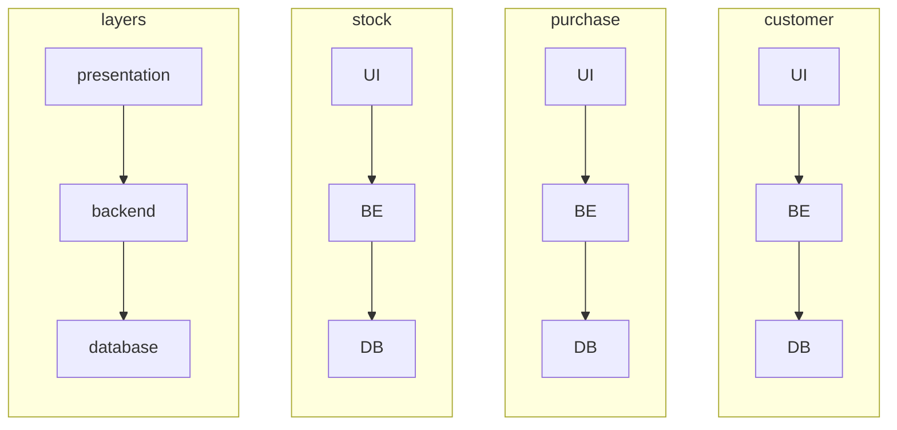

# Building Microservices

[Building Microservices](https://www.amazon.com/dp/B09B5L4NVT)'

by Sam Newman

## Table of Contents

* Part I - Foundation
  * Chapter 1 - What are Microservices?
  * Chapter 2 - How to Model Microservices
  * Chapter 3 - Splitting the Monolith
  * Chapter 4 - Microservice Communication Styles

* Part II - Implementation
  * Chapter 5 - Implementing Microservice Communication
  * Chapter 6 - Workflow
  * Chapter 7 - Build
  * Chapter 8 - Deployment
  * Chapter 9 - Testing
  * Chapter 10 - From Monitoring to Observability
  * Chapter 11 - Security
  * Chapter 12 - Resiliency
  * Chapter 13 - Scaling

* Part III - People
  * Chapter 14 - User Interfaces
  * Chapter 15 - Organizational Structures
  * Chapter 16 - The Evolutionary Architect

## Chapter 1 -  What are Microservices?

* Independent deployability
  * loosely coupled
  * forcing function

* work across services is expensive
  * thus model around business domain
    * not technology

* Traditional 3-tier architecture
  * Web UI
  * Backend
  * Database

* Layers
  * High cohesion of related technology
  * Low cohesion of business functionality

* Hide internal state
  * similar to *encapsulation* in OOP

* Each service has it's own state
  * don't share DBs

> the goal of a microservices is to have "as small an interface as possible"
> \- Chris Richardson (Microservice Patterns)

---

> organizations which design systems... are constrained to produce designs which are copies of the communication structures of these organizations
> \- Melvin Conway (How do Committees Invent?)

[mermaid - tiers](https://mermaid.live/edit#pako:eNqFkj1vwjAQhv-K5SlIzpBkC1UHBEPntluW8_mAiMSO_KEKIf57L0SuKAN48d177z3-vEh0hmQr94P7wSP4KL42ne2s4BGSPniYjgJTiG4kv8jzML0njL2zN_ufWhXfH6uyLE1dbHa3oCm2m9XiIGseuFPyvGagV1zMXMxcfMrl3eLpFVRnqM5Q_RQ6wJl8eEWFqpg8BbIR5trqrSzfoS404ImRS9oUBiJoPvj9YkuYZxwgBKYpXSmslKlEdNP6rral_SwJdIPzrdBDonVG3AFqpWuFtTK1GHvzCGApAzzN1X-9jdKNwkaZRmgXH3tZyr0HT2TXUkn-IyP0hv_TZXZ3Mh5ppE62HBraQxpiJzt7ZWua-BJoZ_rovGyjT6QkpOg-zxZzvni2PfALjIt4_QVk-M92)

