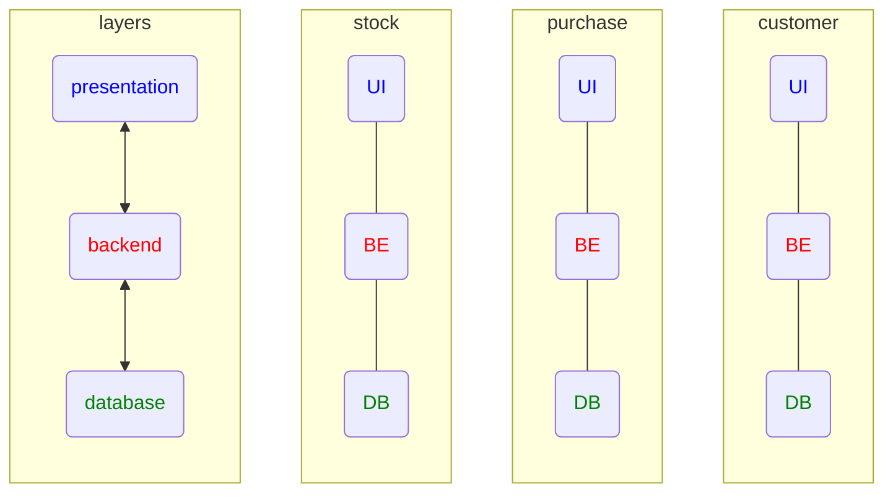
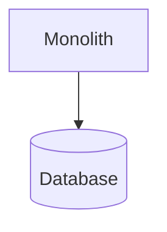
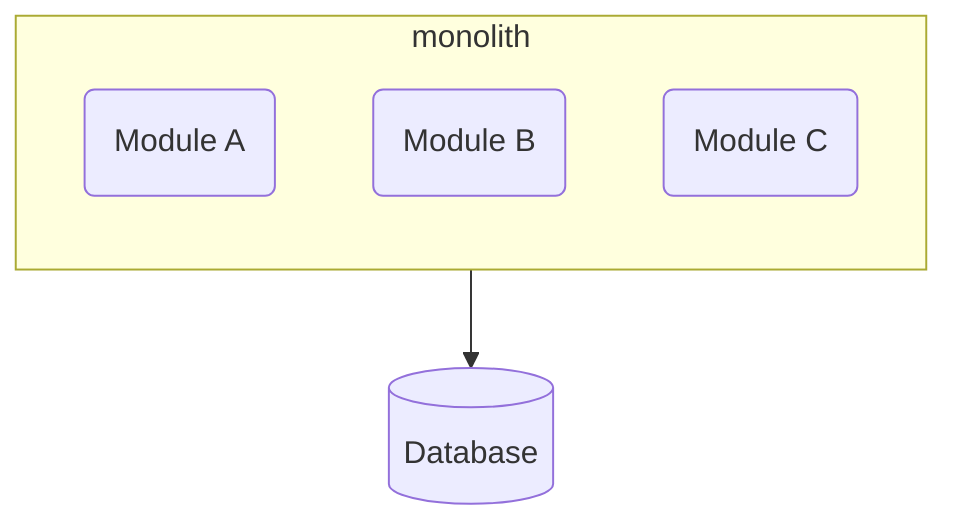
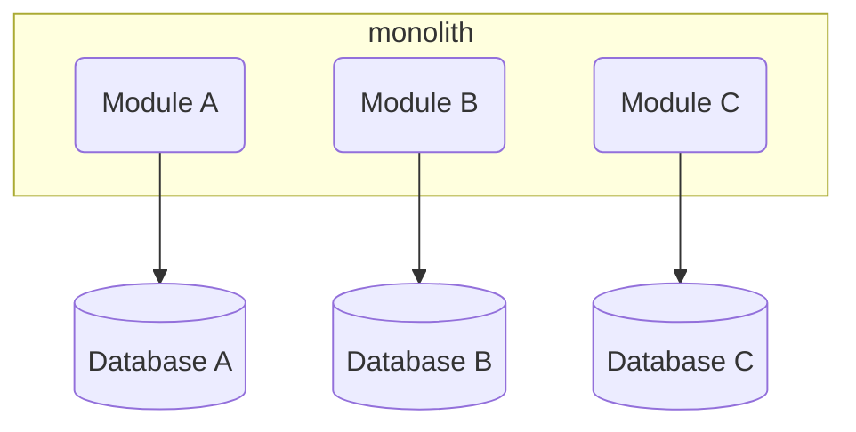
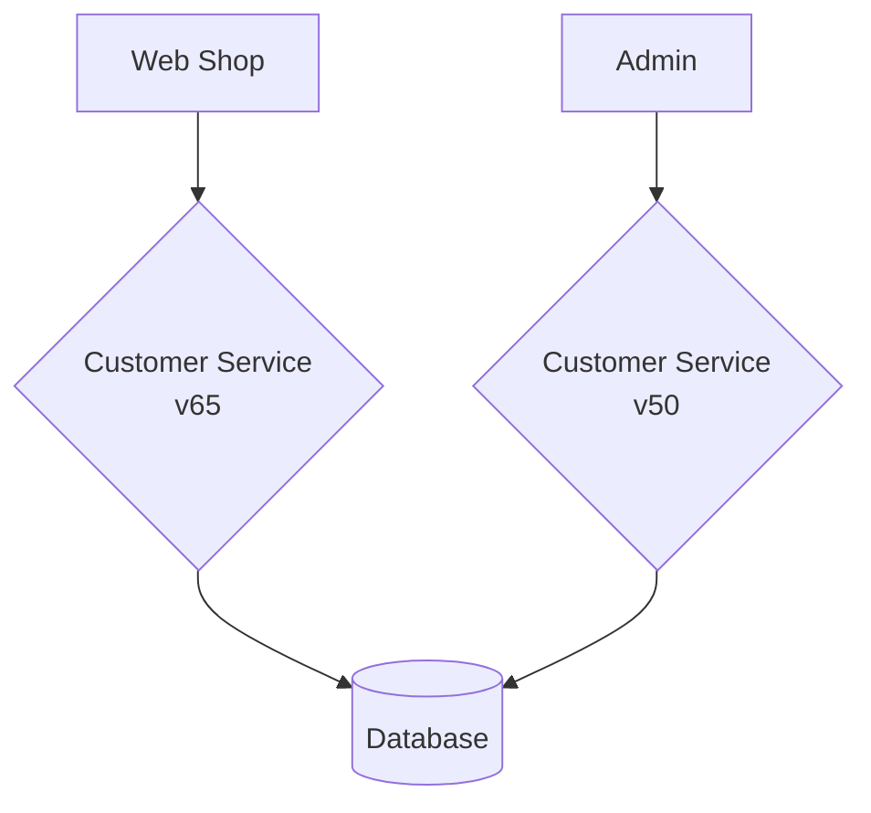

# Building Microservices

[Building Microservices](https://www.amazon.com/dp/B09B5L4NVT)'

by Sam Newman

## Table of Contents

* Part I - Foundation
  * Chapter 1 - What are Microservices?
  * Chapter 2 - How to Model Microservices
  * Chapter 3 - Splitting the Monolith
  * Chapter 4 - Microservice Communication Styles

* Part II - Implementation
  * Chapter 5 - Implementing Microservice Communication
  * Chapter 6 - Workflow
  * Chapter 7 - Build
  * Chapter 8 - Deployment
  * Chapter 9 - Testing
  * Chapter 10 - From Monitoring to Observability
  * Chapter 11 - Security
  * Chapter 12 - Resiliency
  * Chapter 13 - Scaling

* Part III - People
  * Chapter 14 - User Interfaces
  * Chapter 15 - Organizational Structures
  * Chapter 16 - The Evolutionary Architect

## Chapter 1 -  What are Microservices?

* Independent deployability
  * loosely coupled
  * forcing function

* work across services is expensive
  * thus model around business domain
    * not technology

* Traditional 3-tier architecture
  * Web UI
  * Backend
  * Database

* Layers
  * High cohesion of related technology
  * Low cohesion of business functionality

* Hide internal state
  * similar to *encapsulation* in OOP

* Each service has it's own state
  * don't share DBs

> the goal of a microservices is to have "as small an interface as possible"
> \- Chris Richardson (Microservice Patterns)

---

> organizations which design systems... are constrained to produce designs which are copies of the communication structures of these organizations
> \- Melvin Conway (How do Committees Invent?)

[mermaid - tiers](https://mermaid.live/edit#pako:eNqFkj1vwjAQhv-K5SlIzpBkC1UHBEPntluW8_mAiMSO_KEKIf57L0SuKAN48d177z3-vEh0hmQr94P7wSP4KL42ne2s4BGSPniYjgJTiG4kv8jzML0njL2zN_ufWhXfH6uyLE1dbHa3oCm2m9XiIGseuFPyvGagV1zMXMxcfMrl3eLpFVRnqM5Q_RQ6wJl8eEWFqpg8BbIR5trqrSzfoS404ImRS9oUBiJoPvj9YkuYZxwgBKYpXSmslKlEdNP6rral_SwJdIPzrdBDonVG3AFqpWuFtTK1GHvzCGApAzzN1X-9jdKNwkaZRmgXH3tZyr0HT2TXUkn-IyP0hv_TZXZ3Mh5ppE62HBraQxpiJzt7ZWua-BJoZ_rovGyjT6QkpOg-zxZzvni2PfALjIt4_QVk-M92)

### Single Process Monolith

[mermaid - monolith](https://mermaid.live/edit#pako:eNo1yzsOwjAQRdGtRFOBlGzABQUKJRV0mRQTe4wt-YOcsRCKsneMBK-6xXkb6GwYFNiQX9pRke5-xoSpa6PpmlMOXtw8DKdlOowktNDKxxl6iFwiedO-25cjiOPICKqlYUs1CAKmvdH6NCR8MV5yAWUprNwDVcm3d9KgpFT-o9HTo1D8qf0DwIw2lA)

### Modular Monolith

* Compose into modules
* Structured programming in the 1970s
* Much simpler deployment topology
* Allows teams to work in parallel

[mermaid - modular monolith](https://mermaid.live/edit#pako:eNpNj8sKwkAMRX-lZGWh_kAXgq-lK905LtJJagfmUaYZRMR_d4od9K7C4ZDkvkAHYmiht-GhB4xSXXbKK1_lTKm7RxyHygUfrJHhi-eQiazFBP-nz8HVKVCyXG3rH-wK3P1BXeB-geypbCr31usNXVcHFOxw4voGDTiODg3lj1-zq0AGdqygzSNxj8mKAuXfWU0jofCRjIQIbY924gYwSTg_vYZWYuIiHQzmpm6x3h9pelfy)

### Decomposed DB

[mermaid - decomposed db](https://mermaid.live/edit#pako:eNpNkMuKwzAMRX8laNVC-wNZDDTtLGc1sxtnIVvKxOBHcWSGEvrvtWlNc1finItAWsFEYuhhcvHfzJik-xlUUKErWbL-S3idOx9DdFbmJ64hm9iIjWFTr8HdV6TsuDvt31A3OGygafD8ghyobcLj8YPwd3dBQY1L3TY-ja5Gb8zQjKnGbMx5P8IBPCePlsqFa-0pkJk9K-jLSDxhdqJAhXup5iuh8CdZiQn6Cd3CB8As8fsWDPSSMrfSxWL5jH-17g9ol2TC)

### Distributed Monolith

> A distributed system is one in which the failure of a computer you didn’t even know existed can render your own computer unusable.7
> \​- ​Leslie Lamport

* Consists of multiple services
* Must be deployed together

* Changes can ripple across service boundaries

### Delivery Contention

* Confusion around who owns what and who makes decisions

* **Advantages**
  * simpler deployment topology
  * simpler dev workflows
  * simplify code re-use
    * distributed systems need to:
      * copy code
      * break out libraries
      * push shared functionality into service
  * probably correct "default" choice
    * need a reason *not* to use them

### Logging

* [Jaeger](https://www.jaegertracing.io/) - open source, end-to-end distributed tracing
* [Lightstep](https://lightstep.com/) - The cloud-native reliability platform
* [Honeycomb](https://www.honeycomb.io/) - Observability for Distributed Services
* [Humio](https://www.humio.com/) - Modern Log Management for Real-Time Observability

## Chapter 5 - Implementing Microservice Communication

* Diffing Tools
  * [protolock](https://github.com/nilslice/protolock)
  * [json-schema-diff-validator](https://www.npmjs.com/package/json-schema-diff-validator)
  * [Confluent Schema Registry](https://github.com/confluentinc/schema-registry#documentation)

* Managing Breaking Changes
  * Lockstep deployment
  * Coexist incompatible microservice versions
  * Emulate the old interface

Running multiple versions of the same service to support old endpoints

## Contract Tests and Consumer-Driven Contracts (CDCs)

* **CDCs** - Consumer-Driven Contracts

* [Pact](https://pact.io/)

## Chapter 7 - The Build

* **CI** - Continuous Integration
* **CD** - Continuous Delivery - each check-in is treated as a release candidate
* **CD** - Continuous Deployment - each check-in is deployed w/o manual intervention

* Jez Humble’s three questions
  * Do you check in to mainline once per day?
  * Do you have a suite of tests to validate your changes?
  * When the build is broken, is it the #1 priority of the team to fix it?

* Branching Models
  * trunk-based-development - everyone working off the same branch
  * GitFlow

* Build Pipeline

* Artifact Creation
  * Should build an artifact once and once only
  * The artifact you verify should be the artifact you deploy
  * any aspects of configuration that vary from environment to environment need to be kept outside the artifact itself.

### Build Patterns

* One Giant Repo, One Giant Build
  * Pros
    * If I have to work on multiple services at once, I just have to worry about one commit
    * lockstep releases, where you don’t mind deploying multiple services at once.
  * Cons
    * This impacts our cycle time, the speed at which we can move a single change from development to live.

* One Repository per Microservice (aka Multirepo)
  * Cons
    * developers may find themselves working with multiple repositories at a time
      * which is especially painful if they are trying to make changes across multiple repositories at once
    * Changes cannot be made in an atomic fashion across separate repositories,
  * Smell
    * If you are continually making changes across multiple microservices
      * then your service boundaries might not be in the right place,

* Monorepo
  * Structure
    * map multiple builds to different parts of the repo
    * "common" folder used by all microservices, a change to which causes all microservices to be rebuilt.
    * graph-based build tools like the open source [**Bazel**](https://bazel.build/)
  * Pros
    * Improved visibility of other people’s code, the ability to reuse code easily
    * Easy Code-ReUse - When our unit of reuse is a library, we are potentially pulling in more code than we really want.

  * **Note**: atomic commit across multiple services doesn’t give you atomic rollout.

### Defining Ownership

[CodeOwnership](https://martinfowler.com/bliki/CodeOwnership.html)

* **Strong code ownership**
  * If someone from outside that group wants to make a change
    * they have to ask the owners to make the change for them.
* **Weak code ownership**
  * people outside the ownership group are allowed to make changes
    * although any of these changes must be reviewed and accepted by someone in the ownership group.
* **Collective code ownership**
  * any developer can change any other microservice.
  * small number of developers (20 or fewer, as a general guide),

* Github - [`CODEOWNERS` file](https://docs.github.com/en/repositories/managing-your-repositorys-settings-and-features/customizing-your-repository/about-code-owners)
  * ensures that code owners for source files are requested for review whenever a pull request is raised for the relevant files
  * lots of good reasons to aim for smaller pull requests

## Chapter 10 - From Monitoring to Observability

### Production Pain

> You won’t truly appreciate the potential pain, suffering, and anguish caused by a microservice architecture until you have it running in production and serving real traffic.

### Murder Mystery

> Tracking down what’s gone wrong, and what caused it, is our first port of call. But this gets difficult if we have a long list of suspects.

* Multiple Services -> Multiple Servers

### Three Pillars Of Observability

* metrics
* logging
* distributed tracing

New Relic even coined the term **MELT**

* metrics
* event
* logs
* traces

* Log aggregation
  * Collecting information across multiple microservices, a vital building block of any monitoring or observability solution
* Metrics aggregation
  * Capturing raw numbers from our microservices and infrastructure to help detect problems, drive capacity planning, and perhaps even scale our applications
* Distributed tracing
  * Tracking a flow of calls across multiple microservice boundaries to work out what went wrong and derive accurate latency information Are you doing OK?
* Alerting
  * What should you alert on? What does a good alert look like?
* Semantic monitoring
  * Thinking differently about the health of our systems, and about what should wake us up at 3 a.m.
* Testing in production
  * A summary of various testing in production techniques

### Alerting

* Relevant
  * Make sure the alert is of value.
* Unique
  * Ensure that the alert isn’t duplicating another.
* Timely
  * We need to get the alert quickly enough to make use of it.
* Prioritized
  * Give the operator enough information to decide in what order the alerts should be dealt with.
* Understandable
  * The information in the alert needs to be clear and readable.
* Diagnostic
  * It needs to be clear what is wrong.
* Advisory
  * Help the operator understand what actions need to be taken.
* Focusing
  * Draw attention to the most important issues.

> Not testing in prod is like not practicing with the full orchestra because your solo sounded fine at home.
> \- ​Charity Majors

