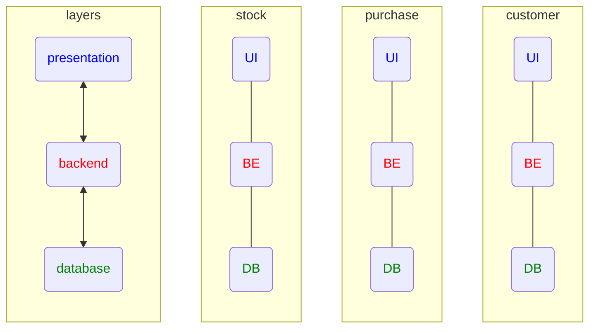
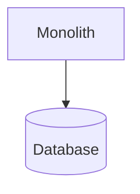
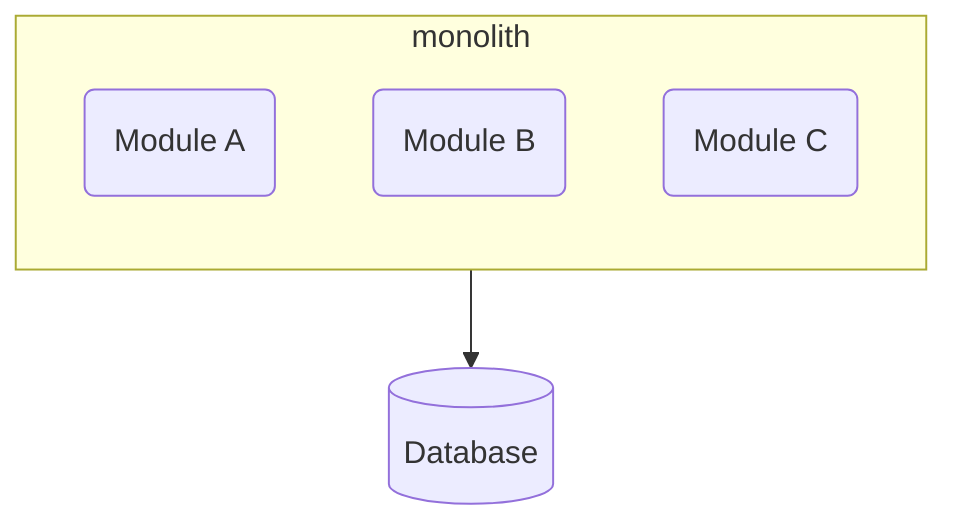
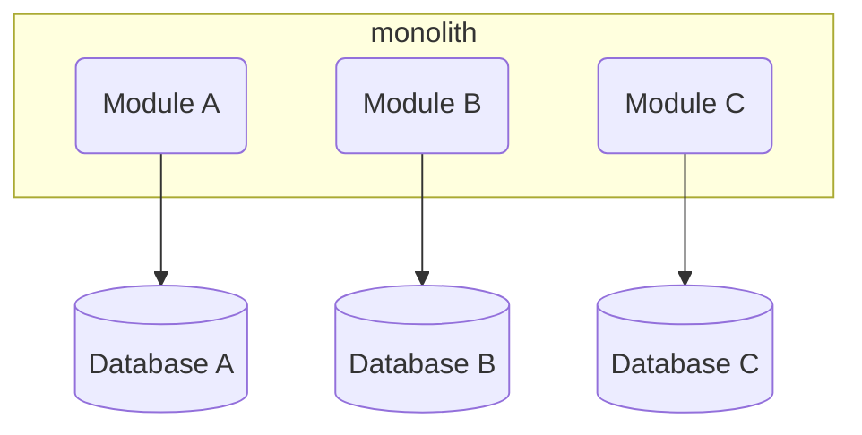
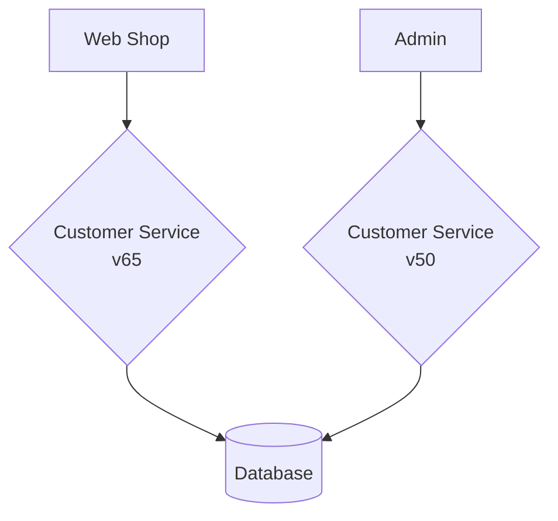

# Building Microservices

[Building Microservices](https://www.amazon.com/dp/B09B5L4NVT)'

by Sam Newman

## Table of Contents

* Part I - Foundation
  * Chapter 1 - What are Microservices?
  * Chapter 2 - How to Model Microservices
  * Chapter 3 - Splitting the Monolith
  * Chapter 4 - Microservice Communication Styles

* Part II - Implementation
  * Chapter 5 - Implementing Microservice Communication
  * Chapter 6 - Workflow
  * Chapter 7 - Build
  * Chapter 8 - Deployment
  * Chapter 9 - Testing
  * Chapter 10 - From Monitoring to Observability
  * Chapter 11 - Security
  * Chapter 12 - Resiliency
  * Chapter 13 - Scaling

* Part III - People
  * Chapter 14 - User Interfaces
  * Chapter 15 - Organizational Structures
  * Chapter 16 - The Evolutionary Architect

## Chapter 1 -  What are Microservices?

* Independent deployability
  * loosely coupled
  * forcing function

* work across services is expensive
  * thus model around business domain
    * not technology

* Traditional 3-tier architecture
  * Web UI
  * Backend
  * Database

* Layers
  * High cohesion of related technology
  * Low cohesion of business functionality

* Hide internal state
  * similar to *encapsulation* in OOP

* Each service has it's own state
  * don't share DBs

> the goal of a microservices is to have "as small an interface as possible"
> \- Chris Richardson (Microservice Patterns)

---

> organizations which design systems... are constrained to produce designs which are copies of the communication structures of these organizations
> \- Melvin Conway (How do Committees Invent?)

[mermaid - tiers](https://mermaid.live/edit#pako:eNqFkj1vwjAQhv-K5SlIzpBkC1UHBEPntluW8_mAiMSO_KEKIf57L0SuKAN48d177z3-vEh0hmQr94P7wSP4KL42ne2s4BGSPniYjgJTiG4kv8jzML0njL2zN_ufWhXfH6uyLE1dbHa3oCm2m9XiIGseuFPyvGagV1zMXMxcfMrl3eLpFVRnqM5Q_RQ6wJl8eEWFqpg8BbIR5trqrSzfoS404ImRS9oUBiJoPvj9YkuYZxwgBKYpXSmslKlEdNP6rral_SwJdIPzrdBDonVG3AFqpWuFtTK1GHvzCGApAzzN1X-9jdKNwkaZRmgXH3tZyr0HT2TXUkn-IyP0hv_TZXZ3Mh5ppE62HBraQxpiJzt7ZWua-BJoZ_rovGyjT6QkpOg-zxZzvni2PfALjIt4_QVk-M92)

### Single Process Monolith

[mermaid - monolith](https://mermaid.live/edit#pako:eNo1yzsOwjAQRdGtRFOBlGzABQUKJRV0mRQTe4wt-YOcsRCKsneMBK-6xXkb6GwYFNiQX9pRke5-xoSpa6PpmlMOXtw8DKdlOowktNDKxxl6iFwiedO-25cjiOPICKqlYUs1CAKmvdH6NCR8MV5yAWUprNwDVcm3d9KgpFT-o9HTo1D8qf0DwIw2lA)

### Modular Monolith

* Compose into modules
* Structured programming in the 1970s
* Much simpler deployment topology
* Allows teams to work in parallel

[mermaid - modular monolith](https://mermaid.live/edit#pako:eNpNj8sKwkAMRX-lZGWh_kAXgq-lK905LtJJagfmUaYZRMR_d4od9K7C4ZDkvkAHYmiht-GhB4xSXXbKK1_lTKm7RxyHygUfrJHhi-eQiazFBP-nz8HVKVCyXG3rH-wK3P1BXeB-geypbCr31usNXVcHFOxw4voGDTiODg3lj1-zq0AGdqygzSNxj8mKAuXfWU0jofCRjIQIbY924gYwSTg_vYZWYuIiHQzmpm6x3h9pelfy)

### Decomposed DB

[mermaid - decomposed db](https://mermaid.live/edit#pako:eNpNkMuKwzAMRX8laNVC-wNZDDTtLGc1sxtnIVvKxOBHcWSGEvrvtWlNc1finItAWsFEYuhhcvHfzJik-xlUUKErWbL-S3idOx9DdFbmJ64hm9iIjWFTr8HdV6TsuDvt31A3OGygafD8ghyobcLj8YPwd3dBQY1L3TY-ja5Gb8zQjKnGbMx5P8IBPCePlsqFa-0pkJk9K-jLSDxhdqJAhXup5iuh8CdZiQn6Cd3CB8As8fsWDPSSMrfSxWL5jH-17g9ol2TC)

### Distributed Monolith

> A distributed system is one in which the failure of a computer you didn’t even know existed can render your own computer unusable.7
> \​- ​Leslie Lamport

* Consists of multiple services
* Must be deployed together

* Changes can ripple across service boundaries

### Delivery Contention

* Confusion around who owns what and who makes decisions

* **Advantages**
  * simpler deployment topology
  * simpler dev workflows
  * simplify code re-use
    * distributed systems need to:
      * copy code
      * break out libraries
      * push shared functionality into service
  * probably correct "default" choice
    * need a reason *not* to use them

### Logging

* [Jaeger](https://www.jaegertracing.io/) - open source, end-to-end distributed tracing
* [Lightstep](https://lightstep.com/) - The cloud-native reliability platform
* [Honeycomb](https://www.honeycomb.io/) - Observability for Distributed Services
* [Humio](https://www.humio.com/) - Modern Log Management for Real-Time Observability

## Chapter 5 - Implementing Microservice Communication

* Diffing Tools
  * [protolock](https://github.com/nilslice/protolock)
  * [json-schema-diff-validator](https://www.npmjs.com/package/json-schema-diff-validator)
  * [Confluent Schema Registry](https://github.com/confluentinc/schema-registry#documentation)

* Managing Breaking Changes
  * Lockstep deployment
  * Coexist incompatible microservice versions
  * Emulate the old interface

Running multiple versions of the same service to support old endpoints

## Contract Tests and Consumer-Driven Contracts (CDCs)

* **CDCs** - Consumer-Driven Contracts

* [Pact](https://pact.io/)
