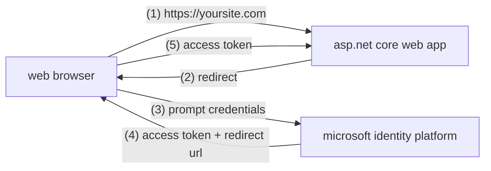

# Azure Authentication

## Azure AD UI

* [Microsoft.AspNetCore.Authentication.AzureAD.UI](https://www.nuget.org/packages/Microsoft.AspNetCore.Authentication.AzureAD.UI/)
* [Authentication.AzureAD.UI](https://github.com/dotnet/aspnetcore/tree/master/src/Azure/AzureAD/Authentication.AzureAD.UI/src)

## Azure Samples

* [Azure-Samples](https://github.com/Azure-Samples)
* [Azure-Samples/active-directory-aspnetcore-webapp-openidconnect-v2](https://github.com/Azure-Samples/active-directory-aspnetcore-webapp-openidconnect-v2)
* [Tutorial - Enable your Web Apps to sign-in users and call APIs with the Microsoft identity platform for developers](https://docs.microsoft.com/en-us/samples/azure-samples/active-directory-aspnetcore-webapp-openidconnect-v2/enable-webapp-signin/)
* [Microsoft identity platform code samples (v2.0 endpoint)](https://docs.microsoft.com/en-us/azure/active-directory/develop/sample-v2-code)

## Tutorial

* [An ASP.NET Core Web app signing-in users with the Microsoft identity platform in your organization](https://github.com/Azure-Samples/active-directory-aspnetcore-webapp-openidconnect-v2/blob/master/1-WebApp-OIDC/1-1-MyOrg/README.md)
* [Quickstart: Add sign-in with Microsoft to an ASP.NET Core web app](https://registeredapps.hosting.portal.azure.net/registeredapps/Content/1.0.01307610/Quickstarts/en/AspNetCoreWebAppQuickstartPage.html)




## Docs

* [Application model](https://docs.microsoft.com/en-us/azure/active-directory/develop/application-model)
* [Microsoft.AspNetCore.Authentication.AzureAD.UI Namespace](https://docs.microsoft.com/en-us/dotnet/api/microsoft.aspnetcore.authentication.azuread.ui?view=aspnetcore-3.0)


## MSAL

* [AzureAD/microsoft-authentication-library-for-js](https://github.com/AzureAD/microsoft-authentication-library-for-js)

```cs
@using System.Security.Claims

@if (User.Identity.IsAuthenticated)
{
    var identity = User.Identity as ClaimsIdentity; // Azure AD V2 endpoint specific
    string preferred_username = identity.Claims.FirstOrDefault(c => c.Type == "preferred_username")?.Value;
    <ul class="nav navbar-nav navbar-right">
        <li class="navbar-text">Hello @preferred_username!</li>
        <li><a asp-area="AzureAD" asp-controller="Account" asp-action="SignOut">Sign out</a></li>
    </ul>
}
else
{
    <ul class="nav navbar-nav navbar-right">
        <li><a asp-area="AzureAD" asp-controller="Account" asp-action="SignIn">Sign in</a></li>
    </ul>
}

```

```json
"AzureAd": {
  "Instance": "https://login.microsoftonline.com/",
  "Domain": "[Enter the domain of your tenant, e.g. contoso.onmicrosoft.com]",
  "TenantId": "f47dbd9a-de7f-4789-adc8-56c73154b7cd",
  "ClientId": "9e6d017c-85fd-4c12-ad91-32c685b876b5",
  "CallbackPath": "/signin-oidc"
},
```

```cs
services.AddAuthentication(AzureADDefaults.AuthenticationScheme)
        .AddAzureAD(options => Configuration.Bind("AzureAd", options));


services.Configure<OpenIdConnectOptions>(AzureADDefaults.OpenIdScheme, options =>
    {
        options.Authority = options.Authority + "/v2.0/";
        options.TokenValidationParameters.ValidateIssuer = true;
    });

services.AddMvc(options =>
        {
            var policy = new AuthorizationPolicyBuilder()
                                .RequireAuthenticatedUser()
                                .Build();
            options.Filters.Add(new AuthorizeFilter(policy));
        })
}
```


## JWT

[jwt.ms](https://jwt.ms/)

## Token

<!-- spellchecker: disable -->


```none
eyJ0eXAiOiJKV1QiLCJhbGciOiJSUzI1NiIsImtpZCI6Imh1Tjk1SXZQZmVocTM0R3pCRFoxR1hHaXJuTSJ9.eyJhdWQiOiI5ZTZkMDE3Yy04NWZkLTRjMTItYWQ5MS0zMmM2ODViODc2YjUiLCJpc3MiOiJodHRwczovL2xvZ2luLm1pY3Jvc29mdG9ubGluZS5jb20vZjQ3ZGJkOWEtZGU3Zi00Nzg5LWFkYzgtNTZjNzMxNTRiN2NkL3YyLjAiLCJpYXQiOjE1OTY5OTEwNDcsIm5iZiI6MTU5Njk5MTA0NywiZXhwIjoxNTk2OTk0OTQ3LCJhaW8iOiJBV1FBbS84UUFBQUE5b0N0dFpKOGNRMFRTRmFqZzNzK3RNcWIrZnVWZlFqYnlsbkZ1cVpLK3VDaU5oeGcvS08vVk9RWkhxT1l5QU5YREZSTEN2VHZyb1ZoeSt0dThWNFJaZ01URnpwTitUTitKMDdkUjBGbmdHeUQrTVdrNW9MTFVCWmF0VlRkMk9zZiIsImlkcCI6Imh0dHBzOi8vc3RzLndpbmRvd3MubmV0LzkxODgwNDBkLTZjNjctNGM1Yi1iMTEyLTM2YTMwNGI2NmRhZC8iLCJuYW1lIjoiS3lsZSBNaXRvZnNreSIsIm5vbmNlIjoiNjM3MzI1ODgxMzY0NzAxODQ0Lk1qRXpaRE5oTkRJdE9XUmtaaTAwTWpnMExUa3haR1V0Tm1Jd056UmlZemhtWmpSaU1XTXdNekE0TlRrdE5tTTFOaTAwWVRRMkxXRXlZak10WW1Fd00yTTNaVGM0TWpoaSIsIm9pZCI6ImViM2M0ZTljLTlmNmYtNGIzZC05ZjQ3LWE0YTg3YTM5MzJiZSIsInByZWZlcnJlZF91c2VybmFtZSI6Ikt5bGVtaXRAZ21haWwuY29tIiwic3ViIjoiaXh6dVZzSG9pdVpqUk1ibHJ3bXhWLUtYLTBJbmIxenRUdW9fOVpXUjlVRSIsInRpZCI6ImY0N2RiZDlhLWRlN2YtNDc4OS1hZGM4LTU2YzczMTU0YjdjZCIsInV0aSI6IlF5anQ2cXQ5ZTA2azJsRzM0QU9GQUEiLCJ2ZXIiOiIyLjAifQ.zU0A8hQwcgsAG10ns1tBxEIyN4vWMJCBDj_9a4q5PgZIzLmCDXyj9jQrFyAIoAjZYtaQ1IrasS1GQwI1cOMyYf07DsNf1HMk109BAJMpxeBqNONkFKnR_-teKhvqmgCtJSH2bpMv2DUU089wzgyqRlpvlw-JmfNjDLIbGaJ3usZAsmqhoxkYvwkGlMxUEdok-Yp6D5sA17cYTuUkJTWE1f_zig1MLLplGRIVJkdBYY4Q-OkUsdQE9_rlTeYeKG0DteVgfdQEqpi2_OpK0Q56ApUkTAXylRDuJjTPvzRJ7TpcWOGFQvSTeMaxzs1c_IAMODALMusuLtFVS5zDbvL19g
```


## Decoded

```json
{
  "typ": "JWT",
  "alg": "RS256",
  "kid": "huN95IvPfehq34GzBDZ1GXGirnM"
}.{
  "aud": "9e6d017c-85fd-4c12-ad91-32c685b876b5",
  "iss": "https://login.microsoftonline.com/f47dbd9a-de7f-4789-adc8-56c73154b7cd/v2.0",
  "iat": 1596991047,
  "nbf": 1596991047,
  "exp": 1596994947,
  "aio": "AWQAm/8QAAAA9oCttZJ8cQ0TSFajg3s+tMqb+fuVfQjbylnFuqZK+uCiNhxg/KO/VOQZHqOYyANXDFRLCvTvroVhy+tu8V4RZgMTFzpN+TN+J07dR0FngGyD+MWk5oLLUBZatVTd2Osf",
  "idp": "https://sts.windows.net/9188040d-6c67-4c5b-b112-36a304b66dad/",
  "name": "Kyle Mitofsky",
  "nonce": "637325881364701844.MjEzZDNhNDItOWRkZi00Mjg0LTkxZGUtNmIwNzRiYzhmZjRiMWMwMzA4NTktNmM1Ni00YTQ2LWEyYjMtYmEwM2M3ZTc4Mjhi",
  "oid": "eb3c4e9c-9f6f-4b3d-9f47-a4a87a3932be",
  "preferred_username": "Kylemit@gmail.com",
  "sub": "ixzuVsHoiuZjRMblrwmxV-KX-0Inb1ztTuo_9ZWR9UE",
  "tid": "f47dbd9a-de7f-4789-adc8-56c73154b7cd",
  "uti": "Qyjt6qt9e06k2lG34AOFAA",
  "ver": "2.0"
}.[Signature]
```


<!-- spellchecker: enable -->

## Claims

* **`aud`** - Identifies the intended recipient of the token. In id_tokens, the audience is your app's Application ID, assigned to your app in the Azure portal. Your app should validate this value, and reject the token if the value does not match.
* **`iss`** - Identifies the security token service (STS) that constructs and returns the token, and the Azure AD tenant in which the user was authenticated. If the token was issued by the v2.0 endpoint, the URI will end in /v2.0. The GUID that indicates that the user is a consumer user from a Microsoft account is 9188040d-6c67-4c5b-b112-36a304b66dad. Your app should use the GUID portion of the claim to restrict the set of tenants that can sign in to the app, if applicable.
* **`iat`** - "Issued At" indicates when the authentication for this token occurred.
* **`nbf`** - The "nbf" (not before) claim identifies the time before which the JWT MUST NOT be accepted for processing.
* **`exp`** - The "exp" (expiration time) claim identifies the expiration time on or after which the JWT MUST NOT be accepted for processing. It's important to note that a resource may reject the token before this time as well - if for example a change in authentication is required or a token revocation has been detected.
* **`aio`** - An internal claim used by Azure AD to record data for token reuse. Should be ignored.
* **`idp`** - Records the identity provider that authenticated the subject of the token. This value is identical to the value of the Issuer claim unless the user account not in the same tenant as the issuer - guests, for instance. If the claim is not present, it means that the value of iss can be used instead. For personal accounts being used in an organizational context (for instance, a personal account invited to an Azure AD tenant), the idp claim may be 'live.com' or an STS URI containing the Microsoft account tenant 9188040d-6c67-4c5b-b112-36a304b66dad.
* **`name`** - The name claim provides a human-readable value that identifies the subject of the token. The value is not guaranteed to be unique, it is mutable, and it's designed to be used only for display purposes. The profile scope is required in order to receive this claim.
* **`nonce`** - The nonce matches the parameter included in the original /authorize request to the IDP. If it does not match, your application should reject the token.
* **`oid`** - The immutable identifier for an object in the Microsoft identity system, in this case, a user account. This ID uniquely identifies the user across applications - two different applications signing in the same user will receive the same value in the oid claim. The Microsoft Graph will return this ID as the id property for a given user account. Because the oid allows multiple apps to correlate users, the profile scope is required in order to receive this claim. Note that if a single user exists in multiple tenants, the user will contain a different object ID in each tenant - they are considered different accounts, even though the user logs into each account with the same credentials.
* **`preferred_username`** - The primary username that represents the user. It could be an email address, phone number, or a generic username without a specified format. Its value is mutable and might change over time. Since it is mutable, this value must not be used to make authorization decisions. The profile scope is required in order to receive this claim.
* **`sub`** - The principal about which the token asserts information, such as the user of an app. This value is immutable and cannot be reassigned or reused. The subject is a pairwise identifier - it is unique to a particular application ID. Therefore, if a single user signs into two different apps using two different client IDs, those apps will receive two different values for the subject claim. This may or may not be desired depending on your architecture and privacy requirements.
* **`tid`** - A GUID that represents the Azure AD tenant that the user is from. For work and school accounts, the GUID is the immutable tenant ID of the organization that the user belongs to. For personal accounts, the value is 9188040d-6c67-4c5b-b112-36a304b66dad. The profile scope is required in order to receive this claim.
* **`uti`** - An internal claim used by Azure to revalidate tokens. Should be ignored.
* **`ver`** - Indicates the version of the token.


## Connecting to SQL Server

### Historically

* Username / Password
  * Multiple username / passwords to manage and secure
  * Password policies are specific to SQL Server
* Windows Authentication
  * Requires domain controller
  * connecting across domains is problematic
  * unsuitable for mixed operating system environment

## Azure AD

[Authorizing access to data in Azure Storage](https://docs.microsoft.com/en-us/azure/storage/common/storage-auth?toc=/azure/storage/blobs/toc.json)
[Authorize access to blobs and queues using Azure Active Directory](https://docs.microsoft.com/en-us/azure/storage/common/storage-auth-aad)

> Authorization with Azure AD is not supported for Azure Table storage. Use Shared Key to authorize requests to Table storage.


[Authorize with Shared Key](https://docs.microsoft.com/en-us/rest/api/storageservices/authorize-with-shared-key)

[Azure Active Directory pricing](https://azure.microsoft.com/en-us/pricing/details/active-directory/)


* Free - $0
* Office 365 - O365 E1, E3, E5, F1, F3
* Premium P1 - $6/user/mo
* Premium P2 - $9/user/mo


## Add Application Roles

[Add app roles in your application and receive them in the token](https://docs.microsoft.com/en-us/azure/active-directory/develop/howto-add-app-roles-in-azure-ad-apps)

### Declare app roles using Azure portal

[Declare app roles using Azure portal](https://docs.microsoft.com/en-us/azure/active-directory/develop/howto-add-app-roles-in-azure-ad-apps#declare-app-roles-using-azure-portal)


Azure AD > App Registrations > App > Manifest

```json
"appRoles": [
    {
      "allowedMemberTypes": [
        "User"
      ],
      "displayName": "Writer",
      "id": "d1c2ade8-98f8-45fd-aa4a-6d06b947c66f",
      "isEnabled": true,
      "description": "Writers Have the ability to create tasks.",
      "value": "Writer"
    }
  ],
```

### Application Manifest

[Azure Active Directory app manifest](https://docs.microsoft.com/en-us/azure/active-directory/develop/reference-app-manifest)
[`appRoles` attribute](https://docs.microsoft.com/en-us/azure/active-directory/develop/reference-app-manifest#approles-attribute)

**`allowedMemberTypes`**: `["User", "Application"]`


"appRoles": [
    {
        "allowedMemberTypes": [
           "User", "Application"
        ],
        "displayName": "Writer",
        "id": "d1c2ade8-98f8-45fd-aa4a-6d06b947c66f",
        "isEnabled": true,
        "description": "Writers Have the ability to create tasks.",
        "value": "Writer"
    }
],

### Assign users and groups to roles

[Assign users and groups to roles](https://docs.microsoft.com/en-us/azure/active-directory/develop/howto-add-app-roles-in-azure-ad-apps)


## Enterprise Application

### User Assignment Required

> If this option is set to yes, then users must first be assigned to this application before being able to access it.
>
> If this option is set to no, then any users who navigate to the application deep-link URL or application URL directly will be > granted access.
>
> This option does not affect whether or not an application appears on the application Access Panel. To show the application > there, assign an appropriate user or group to the application.
>
> This option only functions with the following application types: applications configured for Federated Single Sign-on with > SAML-based Authentication, Application Proxy applications that use Azure Active Directory Pre-Authentication or applications built directly on the Azure AD application platform that use OAuth 2.0 / OpenID Connect Authentication after a user or admin > has consented to that application.
> This option has no effect when an application is configured for any of the other Single Sign-on modes.


[Azure built-in roles](https://docs.microsoft.com/en-us/azure/role-based-access-control/built-in-roles)

| Role                      | Description                                                     |
|---------------------------|-----------------------------------------------------------------|
| Contributor               | Lets you manage everything except granting access to resources. |
| Owner                     | Lets you manage everything, including access to resources.      |
| Reader                    | Lets you view everything, but not make any changes.             |
| User Access Administrator | Lets you manage user access to Azure resources.                 |


[Authentication using Azure Management SDK](https://blog.tylerdoerksen.ca/posts/2018/12/auth-azure-management-sdk.html)


## Rest API Setup

* [Azure REST APIs with Postman in 2 Minutes](https://blog.jongallant.com/2017/11/azure-rest-apis-postman/)
  * [Youtube](https://www.youtube.com/watch?v=fh37VQ3_exk)

### Login

```bash
az login
```

```json
[
  {
    "cloudName": "AzureCloud",
    "homeTenantId": "20b4933b-baad-433c-9c02-70edcc7559c6",
    "id": "24555719-5ecd-4410-8587-b6ac1380e6ee",
    "isDefault": true,
    "managedByTenants": [],
    "name": "AHS-CHATBOT",
    "state": "Enabled",
    "tenantId": "20b4933b-baad-433c-9c02-70edcc7559c6", // subscriptionId
    "user": {
      "name": "Kyle.Mitofsky@vermont.gov",
      "type": "user"
    }
  }
]
```

### Create Service Principal

[`az ad sp create-for-rbac`](https://docs.microsoft.com/en-us/cli/azure/ad/sp?view=azure-cli-latest#az-ad-sp-create-for-rbac)

```bash
az ad sp create-for-rbac -n "kylemitofskysp"
```

<!-- spellchecker: disable -->

```json
{
  "appId": "ec9fb071-e9a1-47d1-bc79-5f046f7c1dd3",  // clientId
  "displayName": "kylemitofskysp",
  "name": "http://kylemitofskysp",
  "password": "E71EkBEU1W.ybbtER-o5xhBUa7Z_1GxH3B", // clientSecret
  "tenant": "20b4933b-baad-433c-9c02-70edcc7559c6"  // tenantId
}
```

<!-- spellchecker: enable -->

### Get AAD Token

<!--  -->

```bash
curl --location --request POST 'https://login.microsoftonline.com/{{tenantId}}/oauth2/token' \
--header 'Content-Type: application/x-www-form-urlencoded' \
--data-urlencode 'grant_type=client_credentials' \
--data-urlencode 'client_id={{clientId}}' \
--data-urlencode 'client_secret={{clientSecret}}' \
--data-urlencode 'resource={{resource}}'
```

<!--  -->

<!-- spellchecker: disable -->


```json
{
    "token_type": "Bearer",
    "expires_in": "3599",
    "ext_expires_in": "3599",
    "expires_on": "1597522331",
    "not_before": "1597518431",
    "resource": "https://management.azure.com",
    "access_token": "eyJ0eXAiOiJKV1QiLCJhbGciOiJSUzI1NiIsIng1dCI6Imh1Tjk1SXZQZmVocTM0R3pCRFoxR1hHaXJuTSIsImtpZCI6Imh1Tjk1SXZQZmVocTM0R3pCRFoxR1hHaXJuTSJ9.eyJhdWQiOiJodHRwczovL21hbmFnZW1lbnQuYXp1cmUuY29tIiwiaXNzIjoiaHR0cHM6Ly9zdHMud2luZG93cy5uZXQvMjBiNDkzM2ItYmFhZC00MzNjLTljMDItNzBlZGNjNzU1OWM2LyIsImlhdCI6MTU5NzUxODQzMSwibmJmIjoxNTk3NTE4NDMxLCJleHAiOjE1OTc1MjIzMzEsImFpbyI6IkUyQmdZUGkwTnJEQi95VEhvUmx6WnAzbU8xSjNDQUE9IiwiYXBwaWQiOiJlYzlmYjA3MS1lOWExLTQ3ZDEtYmM3OS01ZjA0NmY3YzFkZDMiLCJhcHBpZGFjciI6IjEiLCJpZHAiOiJodHRwczovL3N0cy53aW5kb3dzLm5ldC8yMGI0OTMzYi1iYWFkLTQzM2MtOWMwMi03MGVkY2M3NTU5YzYvIiwib2lkIjoiNWQwYzExZjQtNDU0MS00NTU0LWIyODgtM2Y0ZDA5YjgzYWQ1Iiwic3ViIjoiNWQwYzExZjQtNDU0MS00NTU0LWIyODgtM2Y0ZDA5YjgzYWQ1IiwidGlkIjoiMjBiNDkzM2ItYmFhZC00MzNjLTljMDItNzBlZGNjNzU1OWM2IiwidXRpIjoiUmstdVJpY01kME9INE1xU2hOQlhBQSIsInZlciI6IjEuMCIsInhtc190Y2R0IjoxNDM0NDc4NzE3fQ.y-Wn9C5FKZm4AIry6_EzbK4P7ZkWm0CIFyDwOkrfQobEzC-8dObiD-0xJ1kweLgkaqK0MXJ7epTtZvJwtLzWLnTbTrcr1UUEYkhqB0LPk0O735EQYUw9g2sdOxn3-b3VFrV_RN2HxWElZP9SYuxp1WrZ0ofCgQ5vXs0LcO4K1-Hg3URk35M7S_cpLsgFmn5l80g9Xu8R-4RkX-dffGpeAFoSa50peMWl3xJ1LLZT-irsSHah77gZ1aj7DQgWHzu5cDUNRrzjuFR4E1wmCE7Qypxei33B-epu6SvfGPoi_5-5koZlRXaXhDu2TQbTHDkvWB7NJF0xGTZuFAXVMgmFzQ"
}
```

<!-- spellchecker: enable -->

```js
pm.globals.set("bearerToken", pm.response.json().access_token);
```

## Create AAD Service Principal

[How to: Use the portal to create an Azure AD application and service principal that can access resources](https://docs.microsoft.com/en-us/azure/active-directory/develop/howto-create-service-principal-portal)

> When you have applications, hosted services, or automated tools that needs to access or modify resources, you can create an identity for the app. This identity is known as a service principal
> In your Azure subscription, your account must have `Microsoft.Authorization/*/Write` access to assign a role to an AD app.
> This action is granted through the `Owner` role or `User Access Administrator` role.
> If your account is assigned the `Contributor` role, you don't have adequate permission.
