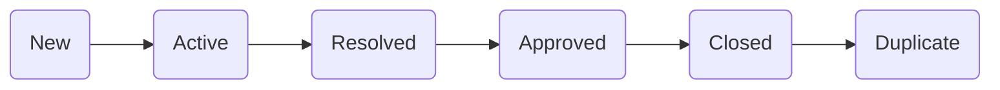

# Azure Devops

[kylemit.visualstudio.com/](https://kylemit.visualstudio.com/)
[dev.azure.com/kylemit/](https://dev.azure.com/kylemit/)

## Docs

* [Release Notes](https://docs.microsoft.com/en-us/azure/devops/release-notes/2020/sprint-173-update)
* [Choose a process](https://docs.microsoft.com/en-us/azure/devops/boards/work-items/guidance/choose-process?view=azure-devops&tabs=basic-process)
* [Get started as a Stakeholder](https://docs.microsoft.com/en-us/azure/devops/organizations/security/get-started-stakeholder?view=azure-devops&tabs=agile-process)
* [DevOps Starter](https://docs.microsoft.com/en-us/azure/devops-project/)
* [Capability Maturity Model Integration (CMMI) process](https://docs.microsoft.com/en-us/azure/devops/boards/work-items/guidance/cmmi-process?view=azure-devops)
* [Plan and Track Work](https://docs.microsoft.com/en-us/azure/devops/boards/get-started/plan-track-work?view=azure-devops&tabs=agile-process)
* Configure & Customize
  * [About area and iteration (sprint) paths](https://docs.microsoft.com/en-us/azure/devops/organizations/settings/work/add-custom-wit?view=azure-devops)
  * [Customize your work tracking experience](https://docs.microsoft.com/en-us/azure/devops/reference/customize-work?view=azure-devops)
  * [Customize a Workflow](https://docs.microsoft.com/en-us/azure/devops/organizations/settings/work/customize-process-workflow?view=azure-devops)
  * [Show bugs on backlogs and boards](https://docs.microsoft.com/en-us/azure/devops/organizations/settings/show-bugs-on-backlog?view=azure-devops)
* Kanban Board Basics
  * [Kanban basics](https://docs.microsoft.com/en-us/azure/devops/boards/boards/kanban-basics?view=azure-devops)
* Collaborate with Others
  * [Add work item tags to categorize and filter lists and boards](https://docs.microsoft.com/en-us/azure/devops/boards/queries/add-tags-to-work-items?view=azure-devops)
* Sprints & Scrum
  * [Schedule Sprints](https://docs.microsoft.com/en-us/azure/devops/boards/sprints/define-sprints?view=azure-devops)
* Queries & Search
  * [Create and save managed queries](https://docs.microsoft.com/en-us/azure/devops/boards/queries/using-queries?view=azure-devops)
* Security, Access, & Identity
  * [About Permissions & Groups](https://docs.microsoft.com/en-us/azure/devops/organizations/security/about-permissions?view=azure-devops&tabs=preview-page)
  * [Permissions lookup guide for Azure DevOps](https://docs.microsoft.com/en-us/azure/devops/organizations/security/permissions-lookup-guide?view=azure-devops)
  * [Set permissions at the project- or collection-level](https://docs.microsoft.com/en-us/azure/devops/organizations/security/set-project-collection-level-permissions?view=azure-devops&tabs=preview-page)


## Release Notes

* [Sprint 186 - May 4th](https://docs.microsoft.com/en-us/azure/devops/release-notes/2021/sprint-186-update)

## Repos

[Browse code, download code](https://docs.microsoft.com/en-us/azure/devops/organizations/public/browse-code-public?view=azure-devops)
[Connect to your Git repos with SSH - Azure Repos | Microsoft Docs](https://docs.microsoft.com/en-us/azure/devops/repos/git/use-ssh-keys-to-authenticate?view=azure-devops)


## Acronyms

* **CMMI** - Capability Maturity Model Integration
* **WITs** - Work Item Types


## Processes


[Choose a process](https://docs.microsoft.com/en-us/azure/devops/boards/work-items/guidance/choose-process?view=azure-devops&tabs=basic-process)

* Basic
* Agile
* Scrum
* CMMI

## Layout

[Work item form](https://docs.microsoft.com/en-us/azure/devops/boards/work-items/about-work-items?view=azure-devops&tabs=agile-process#work-item-form)


## SOV Projects


* [ ] Customize Workflow
* [ ] Add Custom Fields

## Process Types

* **Scrum** - Backlog Items
* **Agile** - Stories
* **CMMI** - Requirements

### Basic


### Agile


### Scrum


### CMMI


## Fields

[Work Item Field Index](https://docs.microsoft.com/en-us/azure/devops/boards/work-items/guidance/work-item-field?view=azure-devops)

```js
let rows = [...document.querySelectorAll(".ms-List-cell")]
let vals = rows.map(el => {
    return {
        name: el.querySelector("[aria-colindex='1']").textContent,
        type: el.querySelector("[aria-colindex='2']").textContent,
        desc: el.querySelector("[aria-colindex='3']").textContent
    }
})
let csv = vals.map(el => `${el.name},${el.type},${el.desc}`).join("\n")
console.table(vals)
```

### Picklist

[Allow Picklist Items to have a specified order](https://developercommunity.visualstudio.com/idea/806292/allow-picklist-items-to-have-a-specified-order.html)

## Plans

[Review team Delivery Plans](https://docs.microsoft.com/en-us/azure/devops/boards/plans/review-team-plans?view=azure-devops)

* Project
* Team
* Backlog


## Overview

### Summary

### Dashboard

### Wiki

* [Provisioned wikis vs. published code as a wiki](https://docs.microsoft.com/en-us/azure/devops/project/wiki/provisioned-vs-published-wiki?view=azure-devops)
* [About Wikis, READMEs, and Markdown](https://docs.microsoft.com/en-us/azure/devops/project/wiki/about-readme-wiki?view=azure-devops)
* [MD - Code highlighting](https://docs.microsoft.com/en-us/azure/devops/project/wiki/markdown-guidance?view=azure-devops#code-highlighting)
  * [highlight.js/src/languages](https://github.com/highlightjs/highlight.js/tree/9.10.0/src/languages)
* [Markdown syntax for files, widgets, and wikis](https://docs.microsoft.com/en-us/azure/devops/project/wiki/markdown-guidance?view=azure-devops)
* [Markdown syntax for wikis in Azure DevOps](https://docs.microsoft.com/en-us/azure/devops/project/wiki/wiki-markdown-guidance?view=azure-devops)
  * [New Advanced Text Editor on the Work Item Form in Azure DevOps](https://devblogs.microsoft.com/devops/new-advanced-text-editor-on-the-work-item-form-in-azure-devops/)
    * [microsoft/roosterjs](https://github.com/Microsoft/roosterjs) - framework-independent javascript rich text editor

## Instant Search

## State




## Marketplace

[Visual Studio Marketplace > ADO](https://marketplace.visualstudio.com/search?term=control%20group%20tab%20page&target=AzureDevOps&category=Azure%20Boards&hosting=cloud&sortBy=Relevance)

## Kanban Board

[Kanban basics](https://docs.microsoft.com/en-us/azure/devops/boards/boards/kanban-basics?view=azure-devops)

[How to Show Blockers on Azure DevOps Taskboards using Tags](https://medium.com/guestline-labs/how-to-show-blockers-on-azure-devops-taskboards-using-tags-cf3e7df26d18)

### Settings

* Cards
  * Fields
    * [x] Disable State (known via column)
* Board
  * Columns
    * [x] New, In Progress, Ready for UAT, Approved, Closed

> The first column is mapped to the initial state used when a work item is created.
> The last column is always mapped to the final state.

## Organization

### Add New User


### Manage User


## API

* [Fields > Get](https://docs.microsoft.com/en-us/rest/api/azure/devops/wit/fields/get?view=azure-devops-rest-6.0)


## Test Plans

* [Add, run, and update inline tests](https://docs.microsoft.com/en-us/azure/devops/boards/boards/add-run-update-tests?view=azure-devops)

## Bulk Import

* [Bulk import or update work items using CSV files](https://docs.microsoft.com/en-us/azure/devops/boards/queries/import-work-items-from-csv?view=azure-devops)
* [Bulk Migrate Work Item Comments, Links and Attachments](https://colinsalmcorner.com/bulk-migrate-work-item-comments-links-and-attachments/)

## Agile VDH (Inherited Process)

### Backlog Levels


* Portfolio
* Requirements
* Iteration
* Other


### Work Item Types


### Issue States


### Batch Edit


## Source Control

* [Tools and clients that connect - Azure DevOps | Microsoft Docs](https://docs.microsoft.com/en-us/azure/devops/user-guide/tools?view=azure-devops)

## Artifacts

* [NuGet (Azure DevOps Artifacts Package Types) | Microsoft Docs](https://docs.microsoft.com/en-us/rest/api/azure/devops/artifactspackagetypes/nuget?view=azure-devops-rest-6.0)
* [Npm (Azure DevOps Artifacts Package Types) | Microsoft Docs](https://docs.microsoft.com/en-us/rest/api/azure/devops/artifactspackagetypes/npm?view=azure-devops-rest-6.0)

## CLI

[Learn about Azure DevOps command line interface extension - Azure DevOps | Microsoft Docs](https://docs.microsoft.com/en-us/azure/devops/cli/?view=azure-devops)

## REST API

* [Get started with the REST APIs for Azure DevOps - Azure DevOps](https://docs.microsoft.com/en-us/azure/devops/integrate/how-to/call-rest-api?view=azure-devops)
* [Get started with the REST APIs for Azure DevOps Services and Team Foundation Server](https://docs.microsoft.com/en-us/rest/api/azure/devops/?view=azure-devops-rest-6.1)
* [Cannot access Azure DevOps API using PAT in cURL command in Bash script](https://stackoverflow.com/questions/62563443/cannot-access-azure-devops-api-using-pat-in-curl-command-in-bash-script)

## Questions

* Split In progress work at end of Sprint

  * [Rollup estimated and actual work using Project](https://docs.microsoft.com/en-us/azure/devops/boards/backlogs/office/rollup-estimated-and-actual-work-using-project?view=tfs-2018)

* Clickable checklist items

  * [Wiki function 'Check List' should allow check wiki checkbox on the page](https://developercommunity.visualstudio.com/t/wiki-function-check-list-should-allow-check-wiki-c/789279)
  * [About task lists - GitHub Docs](https://docs.github.com/en/github/managing-your-work-on-github/about-task-lists)

