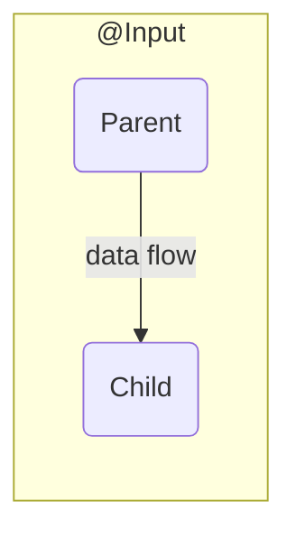

# Angular


## Docs

* [Angular Docs](https://angular.io/docs)
* [Docs > CLI](https://angular.io/cli/)
* [Cheat Sheet](https://angular.io/guide/cheatsheet)

## Concepts

* [Introduction to Angular concepts](https://angular.io/guide/architecture)
* [Angular - Glossary](https://angular.io/guide/glossary#router)
  * [Directives](https://angular.io/guide/glossary#directive)
  * [Components](https://angular.io/guide/glossary#component)
  * [Data Binding](https://angular.io/guide/glossary#data-binding)
  * [Pipe](https://angular.io/guide/glossary#pipe)
  * [Service](https://angular.io/guide/glossary#service)
  * [Router](https://angular.io/guide/glossary#router)


## Template Syntax

* Binds property `value` to the result of expression `firstName`.

  ```html
  <input [value]="firstName">
  ```

* Binds attribute `role` to the result of expression `myAriaRole`.

  ```html
  <div [attr.role]="myAriaRole">
  ```

* Binds the presence of the CSS class `extra-sparkle` on the element to the truthiness of the expression `isDelightful`.

  ```html
  <div [class.extra-sparkle]="isDelightful">
  ```

* Binds `style` property `width` to the result of expression `mySize` in pixels. Units are optional.

  ```html
  <div [style.width.px]="mySize">
  ```

* Calls method `readRainbow` when a `click` event is triggered on this button element (or its children) and passes in the event object.

  ```html
  <button (click)="readRainbow($event)">
  ```

* Binds a property to an interpolated string, for example, "Hello Seabiscuit".

  ```html
  <div title="Hello {{ponyName}}">
  ```

  Equivalent to:

  ```html
  <div [title]="'Hello ' + ponyName">
  ```

* Binds text content to an interpolated string, for example, "Hello Seabiscuit".

  ```html
  <p>Hello {{ponyName}}</p>
  ```

* Sets up two-way data binding.

  ```html
  <my-cmp [(title)]="name">
  ```

  Equivalent to:

  ```html
  <my-cmp [title]="name" (titleChange)="name=$event">
  ```

* Creates a local variable `movieplayer` that provides access to the `video` element instance in data-binding and event-binding expressions in the current template.

```html
<video #movieplayer ...>
  <button (click)="movieplayer.play()">
</video>
```

* The \* symbol turns the current element into an embedded template.

  ```html
  <p *myUnless="myExpression">...</p>
  ```

  Equivalent to:

  ```html
  <ng-template [myUnless]="myExpression"><p>...</p></ng-template>
  ```

* Transforms the current value of expression `cardNumber` via the pipe called `myCardNumberFormatter`.

  ```html
  <p>Card No.: {{cardNumber | myCardNumberFormatter}}</p>
  ```

## Built-in Directives

* `*ngIf`
* `*ngFor`
* `[ngSwitch]`
* `[ngClass]`
* `[ngStyle]`

## Component Lifecycle

[Hooking into the component lifecycle](https://angular.io/guide/lifecycle-hooks)

## Getting Started

[Setting up the local environment and workspace](https://angular.io/guide/setup-local)

```bash
npm install -g @angular/cli
```

### New Project

```bash
ng create <proj-name>
cd proj-name
ng serve --open
```

[Open URL on Launch](https://stackoverflow.com/a/42943826/1366033)

```bash
ng serve -o
```

## Debug Tools

[johnpapa/**vscode-angular-essentials**](https://github.com/johnpapa/vscode-angular-essentials)

## State Management

* NgRX
* Subject Wrapping Services

## Angular Style Guide

[Angular Style Guide](https://angular.io/guide/styleguide)

## Tour Of Heroes App and Tutorial

[Tour of Heroes app and tutorial](https://angular.io/tutorial)

* [Tour of Heroes: Part 6 - StackBlitz](https://stackblitz.com/angular/pyrgjeodnnl)


### File Structure

`/src/styles.scss` - global styles
`/src/index.html` - `<app-root>`
`/src/app/<component>/` - component folders

### Basic Component

```ts
import { Component } from '@angular/core';

@Component({
  selector: 'app-root',
  templateUrl: './app.component.html',
  styleUrls: ['./app.component.scss']
})
export class AppComponent {
  title = 'Tour of Sheroes';
}
```

* Import `Component` class from angular core
* Add `@Component` [class decorator](https://www.typescriptlang.org/docs/handbook/decorators.html#class-decorators) to custom component
* `Component` class takes a `selector`, `templateUrl`, and array of `StyleUrls`
* Custom component exposes data members

#### Component Prefix

`angular.json`

```json
{
  "projects": {
    "client": {
      "prefix": "cm",
    }
  }
}
```

### Shared Modules

* [Sharing modules](https://angular.io/guide/sharing-ngmodules)
* [How do we create shared modules?](https://medium.com/better-programming/angular-4-shared-modules-18ac50f24852)

```ts
import { CommonModule } from '@angular/common';
import { NgModule } from '@angular/core';
import { FormsModule } from '@angular/forms';
import { CustomerComponent } from './customer.component';
import { NewItemDirective } from './new-item.directive';
import { OrdersPipe } from './orders.pipe';

@NgModule({
 imports:      [ CommonModule ],
 declarations: [ CustomerComponent, NewItemDirective, OrdersPipe ],
 exports:      [ CustomerComponent, NewItemDirective, OrdersPipe,
                 CommonModule, FormsModule ]
})
export class SharedModule { }
```


### Dependency Injection

[Dependency injection in Angular](https://angular.io/guide/dependency-injection)

### Component Input / Output

[@Input() and @Output() properties](https://angular.io/guide/inputs-outputs)

**`@Input()` decorator** - use in a child component or directive to let Angular know that a property in that component can receive its value from its parent component
**`@Output()` decorator** - in the child component or directive to allow data to flow from the child out to the parent.



```mermaid
  graph RL

  subgraph "@Output"
     c(Child) <-- data flow --- p(Parent)
  end
```

### Generate Components

```bash
ng generate component heroes
```

#### Generated Spec

```ts
// import fixture and test bed from angular test
import { ComponentFixture, TestBed } from '@angular/core/testing';
// import component we created
import { HeroesComponent } from './heroes.component';

// describe test deck
describe('HeroesComponent', () => {
  // declare component as type HeroesComponent
  let component: HeroesComponent;
  // declare fixture as type Fixture of Heroes
  let fixture: ComponentFixture<HeroesComponent>;

  // setup before each test
  beforeEach(async () => {
    // setup test bed
    await TestBed.configureTestingModule({
      declarations: [ HeroesComponent ]
    })
    .compileComponents();
  });

  beforeEach(() => {
    fixture = TestBed.createComponent(HeroesComponent);
    component = fixture.componentInstance;
    fixture.detectChanges();
  });

  it('should create', () => {
    expect(component).toBeTruthy();
  });
});
```

### Lifecycle Hooks

```ts
ngOnInit() { this.logIt(`OnInit`); }
```


## Questions


[Make directive @Input required](https://stackoverflow.com/q/35528395/1366033)


```ts
function Required(target: object, propertyKey: string) {
  Object.defineProperty(target, propertyKey, {
    get () {
      throw new Error(`Attribute ${propertyKey} is required`);
    },
    set (value) {
      Object.defineProperty(target, propertyKey, {
        value, writable: true, configurable: true,
      });
    },
  });
}

Component({
  selector: 'my-dir',
  template: '<div></div>',
});
export class MyComponent {
  @Input() @Required a: number;
}
```

[How to add “class” to host element?](https://stackoverflow.com/q/34641281/1366033)

* On Init

  ```ts
  export class App implements OnInit {
    @HostBinding('class') class = 'someClass';
    constructor() {}
    ngOnInit() {}
  }
  ```

* Static Host Binding


  ```ts
  import { Component, HostBinding} from '@angular/core';
  @Component({
    selector: 'my-component',
    template: 'app-element',
  })
  export class App {
    @HostBinding('class.someClass1')
    get isItem() {
      return true;
    }
  }
  ```

* Dynamic Class

  ```ts
  @HostBinding('class') get class() {
      return aComponentVariable
  }
  ```

* Add component property

  ```ts
  import { Component} from '@angular/core';
  @Component({
    selector: 'my-component',
    template: 'app-element',
    host: {'class': 'someClass1'}
  })
  export class App {
  }
  ```

* Convert [`HostBinding`](https://angular.io/api/core/HostBinding) to [`host`](https://angular.io/api/core/Directive#host) property

  ```diff
    import {
      Component,
  -    HostBinding
    } from '@angular/core';
    @Component({
      selector: 'my-component',
      template: 'app-element',
  +   host: {'class': 'someClass1'}
    })
    export class App {
  -   @HostBinding('class.someClass1')
  -   get isItem() {
  -     return true;
  -   }
    }
  ```


  However, this is advised against in the angular style guide:

  > [**Style 06-03**](https://angular.io/guide/styleguide#style-06-03)
  > Consider preferring the `@HostListener` and `@HostBinding` to the `host` property of the `@Directive` and `@Component` decorators.


* Change Detection Strategies

[A Comprehensive Guide to Angular onPush Change Detection Strategy](https://netbasal.com/change-detection-strategy-5bac493074a4) by [Netanel Basal](https://twitter.com/NetanelBasal)
[Angular OnPush Change Detection - Avoid Common Pitfalls](https://blog.angular-university.io/onpush-change-detection-how-it-works/)
[angular change detection and ChangeDetectionStrategy.OnPush](https://stackoverflow.com/q/39795634/1366033)
