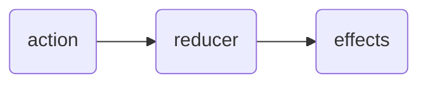
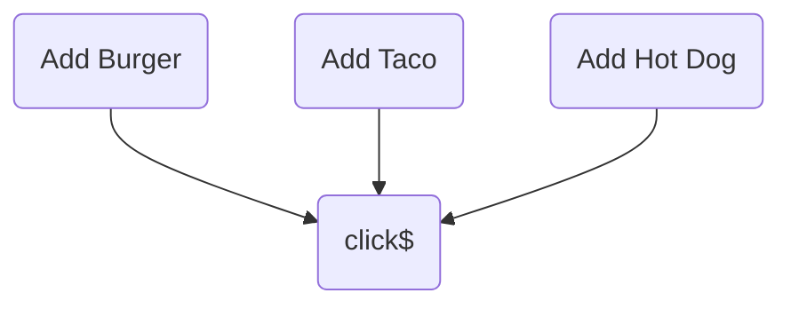

# NGRX


## Talks

### [Good Action Hygiene](https://www.youtube.com/watch?v=JmnsEvoy-gY) by Mike Ryan - Apr 2018

* Action Examples
  * User Events
  * Backend Events
  * Device Events


```ts
interface Action {
    type: string;
}
```

* Action Parts
  * Type
  * Payload

Global Unified Action Stream



* Actions
* Reducer
* Effects
  * Can integrate with browser API
  * Dispatch other actions later


#### 3 Pitfalls to a good action

1. Re-using an action
2. Using Generic Action types
3. Action Sub-Typing

##### 1. Re-using an action

Example Action:

```ts
@component({
    selector: 'menu-page',
    template: `
        <button (click)="addBurger()">Add Burger</button>
        <button (click)="addTaco()">Add Taco</button>
        <button (click)="addHotDog()">Add Hot Dog</button>
    `
})
export class MenuPageComponent {
    constructor(private store: Store<State>) {}

    addBurger() {
        this.store.dispatch({type: '[Burgers]' Add One});
    }
}
```

Could also add from burger detail page

Example Reducer:

```ts
function burgerReducer(state, action) {
    switch (action.type) {
        case: '[Burgers] Add One':
            return [...state, action.burger] // add burger command
        default:
            return state
    }
}
```

**Problem**: can't tell where action came from (cart, menu, details)
**Solution**: replace with specific actions
**Guideline**: actions should capture events, not commands

```diff
  function burgerReducer(state, action) {
      switch (action.type) {
+         case: '[Menu Page] Add Burger':
+         case: '[Burger Details] Add Burger':
-         case: '[Burgers] Add One':
              return [...state, action.burger] // add burger command
          default:
              return state
      }
  }
```

**Problem**: how to dispatch multiple actions within same event
**Solution**: don't - refactor to raise one unique action
**Guideline**: reducers and effects should be the decision makers - components should not determine how state changes - that's violates the point of using event / reducer architecture


##### 2. Using Generic Action types

* Store Dev Tools Log
  * Who dispatched
  * Was it the result of user input/backend?

Before:

```diff
- @ngrx/store/init
- [User] Authenticate
- [User] Authenticate Success
- [Tacos] Add One
- [Tacos] Add One
- [Cart] Checkout
- [Cart] Checkout Success
```

After:

```diff
+ @ngrx/store/init
+ [Login Page] Login
+ [Auth API] Login Success
+ [Menu Page] Add Taco
+ [Taco Details Page] Add Taco
+ [Cart Dropdown] Checkout
+ [Cart API] Checkout Success
```

* **Action Naming Standards**: `[Source] Event`
  * Comes from API - suffix with API
  * Comes from Page - suffix with Page

> Clean code is code you can read after a year and still understand

##### 3. Action Sub-Typing



```ts
interface AddMenuItemAction {
    type: '[Menu Page] Add Menu Item';
    kind: 'burger' | 'taco' | 'hot dog'; // <- this is an action subtype
}
```

**Problem**: Action Subtyping forces nested conditional - hard to unit test
**Solution**: Avoid nested conditionals in reducers and effects
**Guideline**: Constrain action types to be narrow (write more actions). Switch statements allow you to stack case statements through "case fall through"

```ts
function cartReducer(state, action) {
    switch (action.type) {
        case '[Menu Page] Add Burger':
        case '[Menu Page] Add Taco':
        case '[Menu Page] Add Hot Dog':
            return { ...state, loading: true };
    }
}
```

```ts
class CartApiEffects {
    @Effect() saveCart$ = this.actions$
        .ofType(
            '[Menu Page] Add Burger',
            '[Menu Page] Add Taco',
            '[Menu Page] Add Hot Dog',
        )
}
```


#### Guidelines

* Focus on clarity over brevity
* Be empathetic in your architecture design choices
* **Write actions first**
  * Take the time to think about hard problems
  * Forces you to think about all the interactions within an app

* User Actions
  * break up into each page
* Backend Actions
  * break up into API being hit
* Device Actions
  * break up into device API


