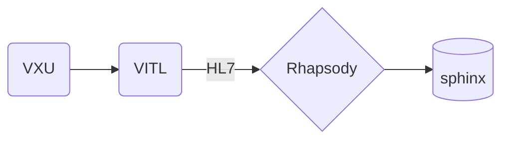
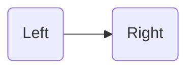
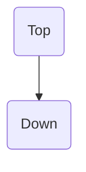
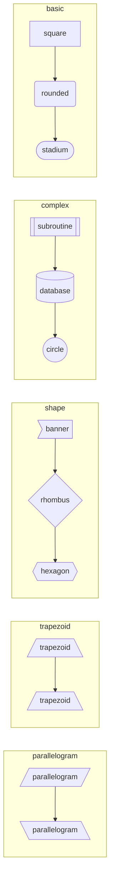
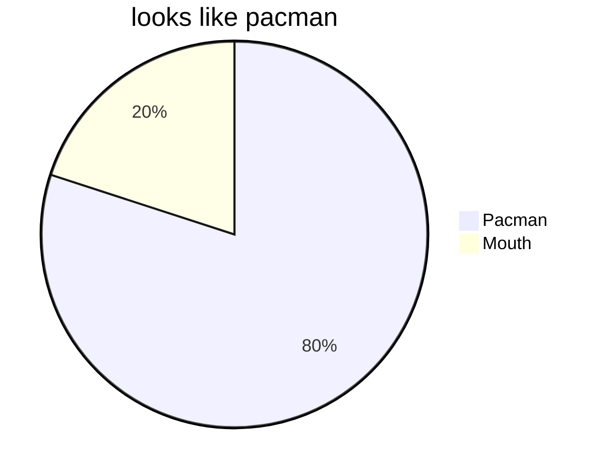
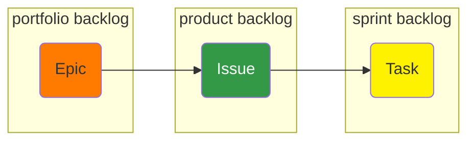
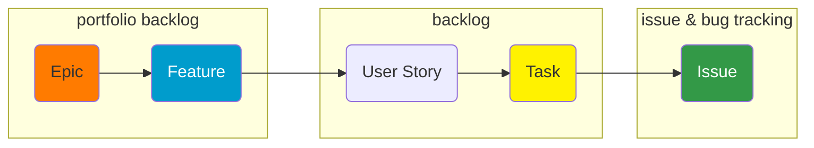
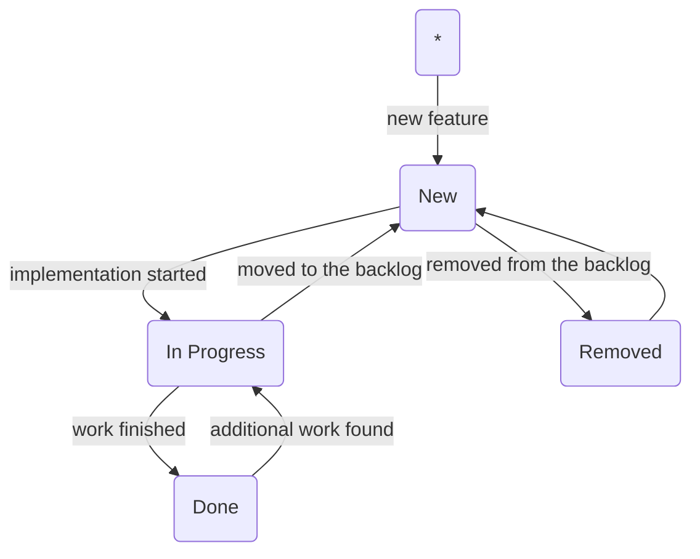
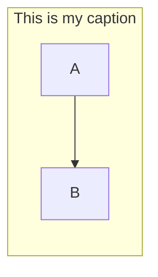

# Mermaid

* [mermaid](https://mermaid-js.github.io/mermaid/#/)

## Alternatives

* [flowchart.js](http://flowchart.js.org/)
* [js-sequence](https://bramp.github.io/js-sequence-diagrams/)
* [platUML](https://plantuml.com/)
* [viz.js](https://github.com/mdaines/viz.js)
* [ditaa](https://github.com/stathissideris/ditaa)

## Types

* [flowchart](https://mermaid-js.github.io/mermaid/#/flowchart)
* [sequence diagram](https://mermaid-js.github.io/mermaid/#/sequenceDiagram)
* [class diagram](https://mermaid-js.github.io/mermaid/#/classDiagram)
* [state diagram](https://mermaid-js.github.io/mermaid/#/stateDiagram)
* [entity relationship diagram](https://mermaid-js.github.io/mermaid/#/entityRelationshipDiagram)
* [user journey](https://mermaid-js.github.io/mermaid/#/user-journey)
* [gantt](https://mermaid-js.github.io/mermaid/#/gantt)
* [pie](https://mermaid-js.github.io/mermaid/#/pie)

### [Flowchart](https://mermaid-js.github.io/mermaid/diagrams-and-syntax-and-examples/flowchart.html)

#### Example

#### Orientation

#### Shapes

### Pie

[Mermaid.js Render Graph Based on Text File](https://stackoverflow.com/q/59807347/1366033)
[Force direction within a subgraph #654](https://github.com/mermaid-js/mermaid/issues/654)

## Examples

### Basic Workflow

### Agile Workflow

### Scrum Process Feature

## Questions

* [Add Title To the Graph](https://github.com/mermaid-js/mermaid/issues/556)

Use Subgraph

