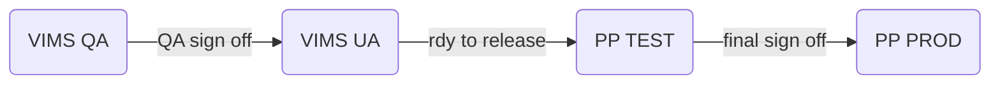

# Release Environment Workflow

## Links

* [Git Workflow](https://balsamiq.cloud/ssbm1o7/pkwo95m/r48B8)
* [Git User Guide](\\\\ahs\ahsfiles\VDH\Divisional Shares\Prog\Training\Developer Resources\JIRA\Git User Guide.docx)
* [Patient Profile Release Environments]("\\ahs\ahsfiles\VDH\Divisional Shares\Prog\Sphinx\Immunization Registry\Patient Profile Release Environments.xlsx")

### File Share Options

* Nessie Folder Share
* Sharepoint
  * Personal One Drive
  * VDH ITS Sharepoint

## Patient Profile Release Environments

* How is this kept up to date?

## Environment Management

### Goals

* One big project shouldn't hold up smaller releases
* produce multiple tiny releases
* Produce clarity on the status of releases
* Guidelines around messaging project status
* When to spin up environment
* visibility on where applications are pointed
* environment encapsulation
  * folder shares
  * emails
  * reports
  * jobs / ssis
  * refreshes
  * database
  * application
  * server
  * AD groups
  * SUMS

### Workflow

* Source Control
  * application
  * database
* Environments
  * For Each Type:
    * application
    * database
  * Questions
    * when to create environment
    * how to migrate changes
      * DEV -> TEST -> PROD

## Production Release Needs

* Steps for production release (Adapt from DDP)
* Checklist reference guide
  * guidance for any decisions points
* Prod Release Checklist (Story Impact Checklist)
  * Backups
  * Users Notified
  * roles
  * Taking offline
  * Disabling Sphinx Login
  * Window

## Application Environment

### App - Standard Environments

* Prod
* Test
* Dev (and sometimes)

### App - Project Environments

* any project that will take >1 wk to move to production

## Database Environments

### DB - Standard Environments

* Prod
* Test
* Dev
* Test Copy of Prod
* Dev Copy of Prod

#### Workflow - Refresh Copy of Prod on Test

* Frequency - Ad Hoc
* Request to Dev Team
  * Changes will have to be redeployed

### DB - Project Environments

* when there's substantial refactoring that might impeded other developers

## general rules

* don't repoint - spin up new env instead

## rdy to release -> prod

* Check
  * check with all app (patient profile) projects
  * indicate readiness to regression test and deploy to prod
    * within 3-5 day window
  * if no one else is using env (check for other users/uses of test i.e. Bridget)
* Push to Test
  * complete merge from proj branch to master
  * push code changes to PP Test & PP STAGE
* Push To Prod
  * deploy code/db changes to prod
  * let folks know that you're out of Shared Tests (visibility indicator?)
  * other dev teams merge master changes into their project branches ASAP

## refresh copy of prod on test

* ask dev project teams if that's okay
  * if not
    * we need to drill into why
      * potentially move those uses cases to a proj database
    * if you can't handle refresh + re-deployment of changes to copy of prod -> probably need your own proj database
  * if so
    * red gate deploy changes
    * re-deploy any stale changes needed in that shared env

## Deployment

What types of things do we deploy?

### Environment Encapsulation

* Local
* Dev
* Test
* Prod

### Domains

* Database
* Types
* SQL Schema (Tables, SPs, Functions)
* SQL Data
* SQL Reporting Services, Integration Services, Analysis Services

### DB - Processes

* Global Admin Tool
  * Redgate
  * Script Template
* Data Request Form
* Deployment Staging Folders

### Application

* Types
  * Windows
    * Citrix
    * ClickOnce
  * Web
    * IIS

### App Processes

* Archive Folders
* Staging Folders
* Proxy
* Config Files
* DLLs
* Dependencies

Rollbacks & Versioning

Git Workflow
master = production
