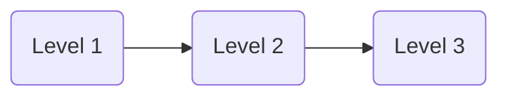

# Software Development LifeCycle

## Support Service Levels

[Soaring Support Tiers](http://soaringent.com/application-support-and-maintenance.html)

### Support Level 1

* Ticket Registration
* Ticket Confirmation to Issue Logger
* Basic Trouble Shooting Support
* FAQ Support
* Installation Support
* Configuration Control
* Solutions from Knowledge Base
* Escalation to Level 2

### Support Level 2

* Escalations From Level 1
* Status Updated to Logger
* Detailed Issue Tracking
* Check Integration Issues
* Hardware and Software Interoperability
* Simulation
* Knowledge Base Entry
* Escalation to Level 3

### Support Level 3

* Escalations from level 2
* Performance Tuning
* Remote Troubleshooting
* Test Lab Simulation
* Environmental Simulation
* Bug Management
  * Bug/ Query Analysis
  * Bug Fixing
  * Regression Testing
* Development Escalations
* Change Management
* Training
* Knowledge Base Updation
