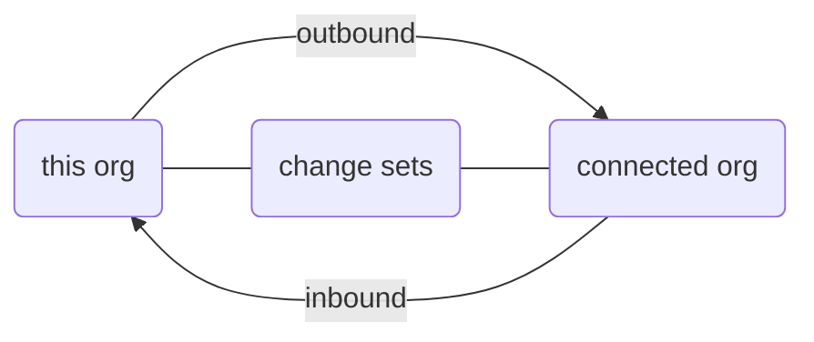
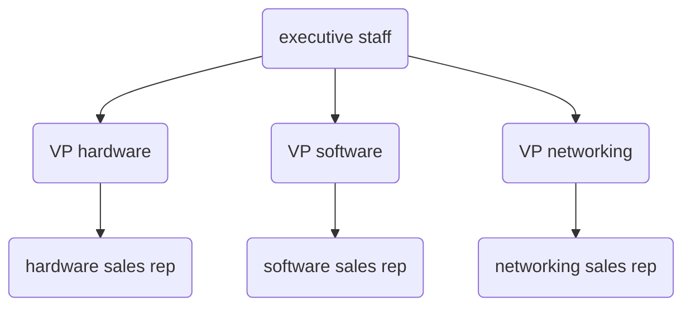
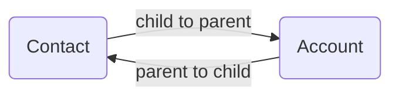

# Salesforce

* [ADS Pilot Training](https://vt-ads-pilot.lightning.force.com/lightning/page/home)
* [ADS Tenant Sandbox](https://vermont--devtrain.lightning.force.com/one/one.app)
* [vermont--devtestsch](https://vermont--devtestsch.lightning.force.com/one/one.app)
* [vermont.my.salesforce.com](https://vermont.my.salesforce.com)
  * [vermont.lightning.force.com](https://vermont.lightning.force.com/)

## Help Links

* [Trailhead](https://trailhead.salesforce.com/en/home)
* [developer.salesforce.com](https://developer.salesforce.com/)
* [salesforce.stackexchange.com](https://salesforce.stackexchange.com/)

* **Salesforce.com** - CRM functionality (the sales, service and marketing applications) - SaaS
* **Force.com** - underlying platform (the database, code, and UI on which all the apps are built) - PaaS

* [Teams Sharepoint - ADS - Salesforce Tech Team](https://vermontgov.sharepoint.com/teams/ADS-SalesForce/SitePages/Home.aspx)
* [Teams Sharepoint - ADS - Salesforce Tech Team - ADS- Salesforce - Sys Admin](https://vermontgov.sharepoint.com/teams/ADS-SalesForce-ADS-Salesforce-SysAdmin)

## Technologies

* [Visualforce](https://help.salesforce.com/articleView?id=pages_about.htm&type=5)
* [pardot](https://www.pardot.com/)
* [ownbackup](https://www.ownbackup.com/)

## Strengths

* Type Picker
  * Universal Metadata
* Define page layout for single object type

## Concerns

* Share picklist across multiple fields
  * https://appexchange.salesforce.com/listingDetail?listingId=a0N30000000pvmXEAQ
* Database backups / restores
* Acid Compliance
* Configurability
* Normalization
* Delete Standard Objects
* Delete Standard Permissions
* Delete Standard Apps

* Object
  * fields
    * Metadata
  * screens
* Tabs
* Apps

* Field level security based on role

### Training

* Trailhead
* Pluralsight

### Data Modeling & Data Governance

* Server > DB > Tables
* Siloed

### Revision Control

* Capado - Revision Control
* OwnBackup - Backups

### Admin Acct

* Sandbox/Dev/Test/Prod
* User Acct


## Intro to SalesForce by [Jerry Conrad](jconrad@salesforce.com)

### Rate of Innovation


### Increased Customer Expectations


### Digital Dilemma


* "Managed platform"
  * every SalesForce customer in the world is on the same version
  * SalesForce manages upgrades
  * take advantage of immediately
  * 3x times per year

### System of Engagement


### Cloud


* SalesForce owns **Heroku** 😲


### Platform Components


### Platform and Apps


* Integration
  * Web Services
    * SOAP API
    * Rest API
    * Bulk API
    * Metadata API
    * Apex
    * VisualForce
  * MuleSoft
    * cloud based service bus
  * Tableau


## API

[Introducing SOAP API](https://developer.salesforce.com/docs/atlas.en-us.api.meta/api/sforce_api_quickstart_intro.htm)
[Data Model](https://developer.salesforce.com/docs/atlas.en-us.api.meta/api/data_model.htm)

### Software as a Service


### Compliance


### Transparency


### App Exchange


### Public Sector


### Examples


### Release Schedule


### Rapid Implementation


### Trailhead


### High Complexity

* Backend complexity
* Best Practices
* SalesForceDX
* Capado
* OwnBackup
  * Sandbox seeding
    * data / masked

They can get a cost savings by combining into a single organization, but sometimes overrules by complexity

* white papers
* case studies

* Step on each other's toes
* Share data where we shouldn't


## Trail Head

* [Trailblazer Profile](https://trailblazer.me/id/kylemit)
  * Achievements
  * Rank
  * Skills
  * Points
  * Badges

### Tips

* Must exactly match requirements
* Spelling Matters
* Split Screen
* Use Trailblazer

### Set Up Visual Studio Code

* [Set Up Visual Studio Code](https://trailhead.salesforce.com/en/content/learn/projects/quick-start-lightning-web-components/set-up-visual-studio-code)
  * [Salesforce Extension Pack](https://marketplace.visualstudio.com/items?itemName=salesforce.salesforcedx-vscode)
  * [How do I disable telemetry reporting?](https://developer.salesforce.com/tools/vscode/en/faq/telemetry/#how-do-i-disable-telemetry-reporting)

### Courses

[Build Apps Together with Package Development](https://trailhead.salesforce.com/en/content/learn/trails/sfdx_get_started)

## UI Overview

### Deploy Changes

#### Monitor Deployments

[Monitor Deployments](https://help.salesforce.com/articleView?id=deploy_monitoring.htm)


#### Change Sets

[Change Sets](https://help.salesforce.com/articleView?id=changesets.htm&type=5)


> A change set is a means by which one organization can send customizations to another organization:
>
> * An outbound change set is a change set created in the organization you are logged into and want to send to another organization.
> * An inbound change set is a change set that has been sent from another organization to the organization you are logged into.
> * Change sets can only contain modifications you can make through the setup menu.
> * Change sets may contain customizations to existing components or new components, but can't be used to delete or rename components.




### Sharing Settings

#### User Role Hierarchy

[User Role Hierarchy](https://help.salesforce.com/articleView?id=admin_roles.htm&type=5)

Example Hierarchy




### Permission Set Assignments

[Assign Permission Sets](https://help.salesforce.com/articleView?id=perm_sets_assigning.htm&type=5)


* Covid Medtech User
* Covid Scheduler User
* Covid VT Admin

### Manage Permission Set


### Permission Analyzer

#### User


### Permission Sets > Assigned Users


### Permission Set > System Permissions

ex. Manage Data Integrations


* [What permissions do I need to import records?](https://help.salesforce.com/articleView?id=faq_import_general_permissions.htm&type=5)
  * Import Custom Objects
  * Create on the custom object
  * Edit on the custom object
* [View Bulk Data Load Job Details](https://help.salesforce.com/articleView?id=monitoring_async_api_jobs_details.htm&type=5)
  * Manage Data Integrations
  * API Enabled
  * View Setup and Configuration

### Object Manager


### App Usage

[Personalize the Navigation Bar in Lightning Experience](https://help.salesforce.com/articleView?id=user_userdisplay_tabs_lex.htm&type=0)


### Delegate Administrative Duties

[Delegate Administrative Duties](https://help.salesforce.com/articleView?err=1&id=admin_delegate.htm&type=5)


## Azure Resource Tags


## Keyboard Shortcuts

[Keyboard Shortcuts for Lightning Experience](https://help.salesforce.com/articleView?id=accessibility_keyboard_shortcuts_lex.htm&type=5)


## Workflow

[Automate Your Business Process > Workflow](https://help.salesforce.com/articleView?id=customize_wf.htm&type=5)


## Lightning Design System

[Lightning Design System](https://www.lightningdesignsystem.com/)

### Fundamentals

* [**Component Blueprints**](https://www.lightningdesignsystem.com/components/overview/) - Ready-to-use HTML and CSS UI elements provide the foundation for Salesforce experience development
* [**Tokens**](https://www.lightningdesignsystem.com/design-tokens/) - Visual design values and attributes that ensure branding and UI consistency at scale
* [**Design Guidelines**](https://www.lightningdesignsystem.com/guidelines/overview/) Design principles and best practices that guide beautiful, consistent, user-friendly product experiences
* [**Tools**](https://www.lightningdesignsystem.com/tools/overview/) - Easy-to-use tools help all Trailblazers optimize workflows and bring Salesforce ideas to life


## Sandboxes

[Environments > Sandboxes](https://vermont.lightning.force.com/lightning/setup/DataManagementCreateTestInstance/home)

* Developer (30/40)
* Developer Pro (0/0)
* Partial Copy (1/1)
* Full (1/1) - stage

## List of Admin Users

[Users > View > Filter](https://vermont.lightning.force.com/lightning/setup/ManageUsers/home)

* Restore to Stage
  * add admin to folks
* OwnBackup
  * Mask sensitive data
  * refresh sensitive data
  * delegate admin -> sign HIPAA
* MTX shouldn't be in prod
  * taken over doing deployments ourselves

## Guidelines

* Vlocity
* HIPAA Playbook


MPI - Salesforce in human service

[BCC](https://www.outreach.io/articles/bcc-to-salesforce-breakdown-how-to-setup-and-drawbacks)

## Licensing


## Salesforce Object Query Language SOQL

* **SOQL** - Salesforce Object Query Language


[Understanding Relationship Names](https://developer.salesforce.com/docs/atlas.en-us.soql_sosl.meta/soql_sosl/sforce_api_calls_soql_relationships_understanding.htm)



### child-to-parent relationships

```sql
SELECT Contact.FirstName, Contact.Account.Name
FROM Contact
```

### parent-to-child relationships

```sql
SELECT Account.Name,
       (SELECT Contact.FirstName, Contact.LastName FROM Account.Contacts)
FROM Account
```

[Salesforce SOQL Filter by child relationship](https://stackoverflow.com/q/21316828/1366033)
[Selecting fields from Contact based on Account subquery?](https://salesforce.stackexchange.com/q/75892/69980)

### Semi Join

```sql
SELECT id, AccountNumber
FROM Account
WHERE id IN (SELECT accountId FROM contact WHERE IsActive = true)
```

## Sandbox

* when a sandbox is created or refreshed:
  * it wipes the users
  * brings the users in from prod
  * adds the sandbox name to the end of the loginid
  * and sets the password to what it has in prod


## Salesforce Inspector

```sql
SELECT Assignee.Name, Assignee.Profile.Name, Assignee.UserPermissionsKnowledgeUser, PermissionSet.Name
FROM PermissionSetAssignment
WHERE permissionset.name LIKE 'Covid%'
```


## Troubleshooting

### What's the difference between `__c` and `__r`

[When to Use `__r` Over `__c` in Salesforce Formulas](https://ledgeviewpartners.com/blog/use-__r-__c-salesforce-formulas/)

> In short, `__c` signifies something custom in Salesforce while `__r` signifies a relationship.
>
> * When you use `__c`, you are telling Salesforce that you need the data that is stored in that particular custom field, whatever it may be.
> * When you instead use `__r`, you are saying you want to access data inside the record that is linked.


## SF + DotNet

[Integrating Force.com with Microsoft .NET](https://developer.salesforce.com/wiki/integrating_force-com_with_microsoft_-net)

### Connected App

[Create a Connected App](https://trailhead.salesforce.com/en/content/learn/projects/build-a-connected-app-for-api-integration/create-a-connected-app)
[Integrating C# .NET and Salesforce's REST API](https://dev.to/rachelsoderberg/integrating-c-net-and-salesforce-s-rest-api-d00)


### Soap

* **SOQL** - Salesforce Object Query Language
* **SOSL** - Salesforce Object Search Language


[Introduction to SOQL and SOSL](https://developer.salesforce.com/docs/atlas.en-us.226.0.soql_sosl.meta/soql_sosl/sforce_api_calls_soql_sosl_intro.htm)

[API > query()](https://developer.salesforce.com/docs/atlas.en-us.api.meta/api/sforce_api_calls_query.htm)


### REST

[Execute a SOQL Query](https://developer.salesforce.com/docs/atlas.en-us.api_rest.meta/api_rest/dome_query.htm?search_text=Bearer%20token)


```bash
curl https://vermont.my.salesforce.com/services/data/v20.0/query/?q=SELECT+name+from+Account -H "Authorization: Bearer token"
```

[Explore the Salesforce APIs with a Postman Collection](https://developer.salesforce.com/blogs/2020/03/explore-the-salesforce-apis-with-a-postman-collection.html)
[scolladon/postman-salesforce-apis](https://github.com/scolladon/postman-salesforce-apis)

```bash
https://vermont.my.salesforce.com/services/data/
```

Populate Result Upload Date
When Results != Null

## Inspection Tools

* [Chrome SalesForce Inspector](https://chrome.google.com/webstore/detail/salesforce-inspector/aodjmnfhjibkcdimpodiifdjnnncaafh?hl=en)
* [Lightning Extension](https://chrome.google.com/webstore/detail/lightning-extension/hfglcknhngdnhbkccblidlkljgflofgh/related?hl=en-US)
* [Salesforce Lightning Inspector](https://chrome.google.com/webstore/detail/salesforce-lightning-insp/pcpmcffcomlcjgpcheokdfcjipanjdpc/related?hl=en)
* [Source](https://github.com/sorenkrabbe/Chrome-Salesforce-inspector)
* [Workbench](https://workbench.developerforce.com/query.php)
* [Power Query > Connectors > Salesforce Objects](https://docs.microsoft.com/en-us/power-query/connectors/salesforceobjects)
* [SoqlX](https://github.com/superfell/SoqlX) for Mac

## Development

* [Salesforce DX Setup Guide](https://developer.salesforce.com/docs/atlas.en-us.sfdx_setup.meta/sfdx_setup/sfdx_setup_intro.htm)
* [Install the Salesforce CLI](https://developer.salesforce.com/docs/atlas.en-us.sfdx_setup.meta/sfdx_setup/sfdx_setup_install_cli.htm#sfdx_setup_install_cli)
* [Salesforce Extensions for VSCode](https://developer.salesforce.com/tools/vscode/)
* [Salesforce Extension Pack](https://marketplace.visualstudio.com/items?itemName=salesforce.salesforcedx-vscode)
* [forcedotcom/salesforcedx-vscode](https://github.com/forcedotcom/salesforcedx-vscode)


### SF DX CLI

#### Install CLI

```bash
npm install sfdx-cli --global
```

#### Verify CLI

```bash
sfdx --version
```


## DOM

[Modifying DOM Elements Managed by the Aura Components Programming Model](https://developer.salesforce.com/docs/atlas.en-us.lightning.meta/lightning/js_dom_modify_framework.htm)

## Analytics

* [Google Analytics™ for Salesforce Communities Package](https://help.salesforce.com/articleView?id=networks_g_a_intro_parent.htm&type=5)
* [gtag](https://developers.google.com/analytics/devguides/collection/gtagjs)
* [How to track in Google Analytics what data the user entered in the input?](https://stackoverflow.com/a/61241460/1366033)


## Apex

### Apex Classes


### Apex Limit


### Apex Developer Console


### Open Execute Anonymous

Debug > Open Execute Anonymous Window <kbd>Ctrl</kbd> + <kbd>E</kbd>


### Execute Anonymous Window


### Execute Anonymous Logs


[Salesforce List of Sobject with group by](https://salesforce.stackexchange.com/q/220544/69980)

