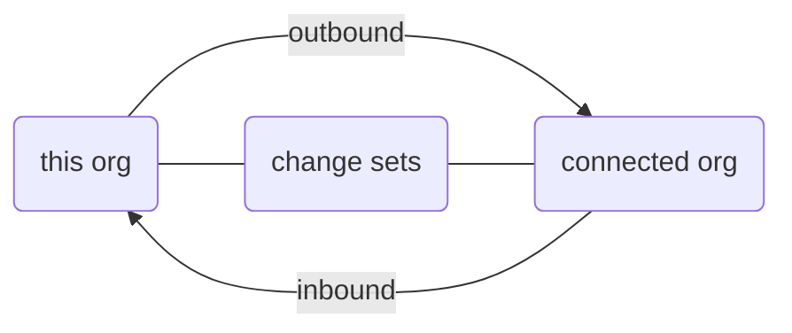
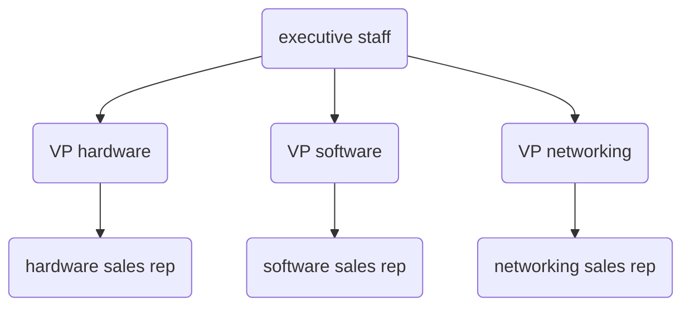
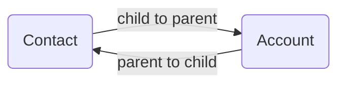

# Salesforce

* [ADS Pilot Training](https://vt-ads-pilot.lightning.force.com/lightning/page/home)
* [ADS Tenant Sandbox](https://vermont--devtrain.lightning.force.com/one/one.app)
* [vermont--devtestsch](https://vermont--devtestsch.lightning.force.com/one/one.app)
* [vermont.my.salesforce.com](https://vermont.my.salesforce.com)
  * [vermont.lightning.force.com](https://vermont.lightning.force.com/)

## Help Links

* [Trailhead](https://trailhead.salesforce.com/en/home)
* [developer.salesforce.com](https://developer.salesforce.com/)
* [salesforce.stackexchange.com](https://salesforce.stackexchange.com/)

* **Salesforce.com** - CRM functionality (the sales, service and marketing applications) - SaaS
* **Force.com** - underlying platform (the database, code, and UI on which all the apps are built) - PaaS

* [Teams Sharepoint - ADS - Salesforce Tech Team](https://vermontgov.sharepoint.com/teams/ADS-SalesForce/SitePages/Home.aspx)
* [Teams Sharepoint - ADS - Salesforce Tech Team - ADS- Salesforce - Sys Admin](https://vermontgov.sharepoint.com/teams/ADS-SalesForce-ADS-Salesforce-SysAdmin)

## Technologies

* [Visualforce](https://help.salesforce.com/articleView?id=pages_about.htm&type=5)
* [pardot](https://www.pardot.com/)
* [ownbackup](https://www.ownbackup.com/)

## Strengths

* Type Picker
  * Universal Metadata
* Define page layout for single object type

## Concerns

* Share picklist across multiple fields
  * https://appexchange.salesforce.com/listingDetail?listingId=a0N30000000pvmXEAQ
* Database backups / restores
* Acid Compliance
* Configurability
* Normalization
* Delete Standard Objects
* Delete Standard Permissions
* Delete Standard Apps

* Object
  * fields
    * Metadata
  * screens
* Tabs
* Apps

* Field level security based on role

## Delegate admin role 7/6

VDH Event Registration

### People

* @Kevin.Pecor - system admin
* @Troy.Morton - system admin

### Training

* Trailhead
* Pluralsight

### Governance

* What training are you taking?
  * Ping @Kevin & @Troy

### Data Modeling & Data Governance

* Server > DB > Tables
* Siloed

### Work in Progress

Enterprise Effort - Data Modeling
Enterprise Best Practices

* naming conventions
* BAA -
* sandboxes to existing apps
  * HIPAA signing
  * grok current naming conventions
* folder for written docs


### Roles

* DDI - Design, Development, Implement
  * FTE (Full Time Equivalency) for maintainence
  * MTX - builds em' - roll the dice on maintaining
    * basic - maintain in house
    * enhancements - middle ground
    * advanced - MTX folks
      * retainer vendors
* Admin
* M&O

### Revision Control

* Capado - Revision Control
* OwnBackup - Backups

### Admin Acct

* Sandbox/Dev/Test/Prod
* User Acct


## Salesforce Admin Meeting 7/8


### People


#### ADS

* **Platform**
  * @Jennifer.Pax
  * @Michael.LaPera
* **Integration**
  * @Troy.Morton
  * @Kevin.Pecor
* @Chris.Bliven
* @Dan.Chase
* @Mark.Combs
* @Becky-Jo.Cyr
* @Cara.Herring - AOE - working with changeset - completed first change to AOE response app - 17k points - 19badges
* @John.Hunt
* @Matt.Lofgren -
* @Jenny.McAdam (Jen) -
* @Michael.Nagle
* @Randall.Connelly (Randy) - DAIL IT Manager - Housing Inspection Application - support Allison Loebs
  * @Tela.Torrey (Teal-ah) - PM Assigned ot DAIL
  * @Allison.Loebs - DAIL - Housing Inspection App - Enhancements - Some in-house - Reports / Report Snapshots
* @Daniel.A.Jarvis - Dept. Public Safety - Phase 2 Dev - Change Sets
  * @Patricia.Martin (Trisha) - Inventory Application - Data Objects - Minimal salesforce screens - update inventory using screens - 18k points - 14 badges
* @Bill.Froberg
* @Donald.Hefferon
* @Charlie.Zimmermann - .NET dev for ACCD

#### SalesForce

* @sconnolly@salesforce.com (Sean) - Presenter
* @samuel.shankar@salesforce.com (Sam) - Dev Ops
* @jconrad@salesforce.com (Jerry)
* @wshelton@salesforce.com
* @aghousheh@salesforce.com (Ameer) - first point of contact

#### MTX

* @jill.brabender@mtxb2b.com


### Survey Report - Training Topics

Important Topics

1. Dev Ops
2. MuleSoft
3. Reporting Dashboards vs Einstein Analytics vs Tableau
4. Data Model
5. Org Health Check
6. Solutions addressing COVID
7. Governor's Office
8. Integration w/ Legacy Applications
9. 311 Services
10. Licensing, Permitting, Inspections
11. Org Strategy
12. SalesForce Connect
13. SalesForce Maps
14. SalesForce Platform Governance
15. Feature Adoption vs User Adoption vs Platform Adoption
16. How to define success metrics for your SalesForce Platform
17. Release Management
18. Solutions Encompassing Children (Child Care, Foster Care, Comprehensive Child Welfare Information System (CCWIS), Early Edu)
19. Technical Debt Reduction
20. Digital Transformation of City vs. Department
21. Economic Development (Business One Stop, Licensing Legal, Revenue)
22. SalesForce Application Design Approach
23. SalesForce Developer Overview: Declarative vs. Code
24. [Vlocity](https://vlocity.com/partners/salesforce)
25. Grants Management
26. Instructor Lead Trainings vs. Trailhead based training vs Certification
27. Legal Case Management
28. SalesForce WORK.com

### Info

* [vt-ads-pilot](http://vt-ads-pilot.lightning.force.com/lightning)
* [The Difference between Salesforce System Integrators (SIs) and Independent Software Vendors (ISVs)](https://powerofus.force.com/s/article/SFDO-CS-Salesforce-SIs-vs-ISVs)

### Bottlenecks

* Don't have shiny onboarders
* Have multiple people all trying to get in SalesForce
* Have lots of people taking advantage of different systems
* Inconsistent implementation of technologies
* @Allison - struggling with Visual Source Code in APEX code, getting into source control


### Updates

* [Salesforce Summer ’20 Release Notes](https://releasenotes.docs.salesforce.com/en-us/summer20/release-notes/salesforce_release_notes.htm)
* [Summer 20' Update Summary](https://www.reddit.com/r/salesforce/comments/gqu0g3/summer_20_release_notes_abridged_edition/)
* Capado Training


## SalesForce Onboarding 7/9

### People

* @Jennifer.Pax
* @Michael.LaPera

* Dev Ops
* Administration
* Release Management


### Naming Conventions

* Single Table
* Prefix Table
* Core Table + Extended Table

### Styles

* Development
* SalesForce
* SalesForce Dev

### Governance

* Craig Benson (previously)
* Amber DeVoss (previously)
* Kevin Pecor (soon)

* use [vlocity](https://vlocity.com/)

* need SalesForce Architect
* 2x EA1 (PG26)
* Best Practice - stub my toe
* Knowing gotchas

### Action Items

* ADS Pilot Site
* Link to Trailhead
* Dev Train Sandbox
  * ex. see all custom fields linked to Account Object
* Add to SalesForce Teams
  * x would be helpful
* Decentralized governance
* Portfolio Management
* Onboarding

### Documentation

Ex. SalesForce Tech Team > General > Files > App Documentation
[AOE Response Team](https://vermontgov.sharepoint.com/teams/ADS-SalesForce/Shared%20Documents/General/App%20Documentation/AOE%20Response%20Team)

* Data Dictionary
* Metadata Deployment Play Book
* Data Model
* ERD
* User Guide
* VT Response Team
* Compliance Categorization

### Doc Needs

* Living Docs
* Difficult to find out which app is using it


### Dev Train

Shared

* Apps
* Objects

### Permissions

Sys Admin in Sandbox
Delegate Admin - Adm

Schema Builder -> All is huge
Shared Responsibility Model

### Logins

* **SSO** - Single Sign On not available
* Each sandbox requires unique username
* `first.last@vermont.gov.sandbox_name`

### Data Modeling

* insulate apps from each other
* SalesForce native
  * Contact
  * Account


### Release Mgmt

* Dev Ops
* Custom Object
* Shared Object
  * gates for review
* Active Maintainence
  * Shared objects


### Revision Control

* Capado
  * Canned regression tests
  * Selenium - Integration Testing Engine
    * **CST** - [Copado Selenium Testing](https://docs.copado.com/article/eg64vsc73o-copado-selenium-testing-cst)
* Using Shared object
  * Are they allowed?


## SalesForce Admin Meting 7/22

### Intro to SalesForce by [Jerry Conrad](jconrad@salesforce.com)

#### Rate of Innovation


### Increased Customer Expectations


### Digital Dilemma


* "Managed platform"
  * every SalesForce customer in the world is on the same version
  * SalesForce manages upgrades
  * take advantage of immediately
  * 3x times per year

### System of Engagement


### Cloud


* SalesForce owns **Heroku** 😲


### Platform Components


### Platform and Apps


* Integration
  * Web Services
    * SOAP API
    * Rest API
    * Bulk API
    * Metadata API
    * Apex
    * VisualForce
  * MuleSoft
    * cloud based service bus
  * Tableau


## API

[Introducing SOAP API](https://developer.salesforce.com/docs/atlas.en-us.api.meta/api/sforce_api_quickstart_intro.htm)
[Data Model](https://developer.salesforce.com/docs/atlas.en-us.api.meta/api/data_model.htm)

### Software as a Service


### Compliance


### Transparency


### App Exchange


### Public Sector


### Examples


### Release Schedule


### Rapid Implementation


### Trailhead


### High Complexity

* Backend complexity
* Best Practices
* SalesForceDX
* Capado
* OwnBackup
  * Sandbox seeding
    * data / masked

They can get a cost savings by combining into a single organization, but sometimes overrules by complexity

* white papers
* case studies

* Step on each other's toes
* Share data where we shouldn't

## VT Governance

* Platform Admins
  * Mike
  * Jen
* Delegate Admins
  * On Dev/Test Sandbox

* Charlie Zimmerman
  * Wh

### Apps on VT Tenant


* DAIL Inspection
* VT - AHS
* AOT IDIQ
* HCQC Console
* DOL Claims
* DOL Review
* AOE Response Team
* Inventory Management

ACCD?

Don't have the luxury of normalizing info
Most apps are going to be ephemeral - so pose no long term risk

### Next Up

August 5th - Demo MuleSoft w/ MuleSoft team


## Trail Head

* [Trailblazer Profile](https://trailblazer.me/id/kylemit)
  * Achievements
  * Rank
  * Skills
  * Points
  * Badges

### Tips

* Must exactly match requirements
* Spelling Matters
* Split Screen
* Use Trailblazer

### Set Up Visual Studio Code

* [Set Up Visual Studio Code](https://trailhead.salesforce.com/en/content/learn/projects/quick-start-lightning-web-components/set-up-visual-studio-code)
  * [Salesforce Extension Pack](https://marketplace.visualstudio.com/items?itemName=salesforce.salesforcedx-vscode)
  * [How do I disable telemetry reporting?](https://developer.salesforce.com/tools/vscode/en/faq/telemetry/#how-do-i-disable-telemetry-reporting)

### Courses

[Build Apps Together with Package Development](https://trailhead.salesforce.com/en/content/learn/trails/sfdx_get_started)

### Spring 2020

* **Task Queue Assignment**


## Error Reporting & Resolution

* Logging?
* Real Time Issues?
* Contractual Turn around time - few weeks


## UI Overview

### Deploy Changes

#### Monitor Deployments

[Monitor Deployments](https://help.salesforce.com/articleView?id=deploy_monitoring.htm)


#### Change Sets

[Change Sets](https://help.salesforce.com/articleView?id=changesets.htm&type=5)


> A change set is a means by which one organization can send customizations to another organization:
>
> * An outbound change set is a change set created in the organization you are logged into and want to send to another organization.
> * An inbound change set is a change set that has been sent from another organization to the organization you are logged into.
> * Change sets can only contain modifications you can make through the setup menu.
> * Change sets may contain customizations to existing components or new components, but can't be used to delete or rename components.




### Sharing Settings

#### User Role Hierarchy

[User Role Hierarchy](https://help.salesforce.com/articleView?id=admin_roles.htm&type=5)

Example Hierarchy




### Permission Set Assignments

[Assign Permission Sets](https://help.salesforce.com/articleView?id=perm_sets_assigning.htm&type=5)


* Covid Medtech User
* Covid Scheduler User
* Covid VT Admin

### Manage Permission Set


### Permission Analyzer

#### User


### Permission Sets > Assigned Users


### Permission Set > System Permissions

ex. Manage Data Integrations


* [What permissions do I need to import records?](https://help.salesforce.com/articleView?id=faq_import_general_permissions.htm&type=5)
  * Import Custom Objects
  * Create on the custom object
  * Edit on the custom object
* [View Bulk Data Load Job Details](https://help.salesforce.com/articleView?id=monitoring_async_api_jobs_details.htm&type=5)
  * Manage Data Integrations
  * API Enabled
  * View Setup and Configuration

### Object Manager


### App Usage

[Personalize the Navigation Bar in Lightning Experience](https://help.salesforce.com/articleView?id=user_userdisplay_tabs_lex.htm&type=0)


### Delegate Administrative Duties

[Delegate Administrative Duties](https://help.salesforce.com/articleView?err=1&id=admin_delegate.htm&type=5)


## Azure Resource Tags


## Keyboard Shortcuts

[Keyboard Shortcuts for Lightning Experience](https://help.salesforce.com/articleView?id=accessibility_keyboard_shortcuts_lex.htm&type=5)


## Documentation

* [Guide for Delegate Admins for Onboarding a NEW SF App](https://vermontgov.sharepoint.com/:w:/r/teams/ADS-SalesForce/_layouts/15/Doc.aspx?sourcedoc=%7B83DE8A46-28D2-4C37-AC93-5184DB5DE246%7D)
* [Delegate Admin Responsibilities](https://vermontgov.sharepoint.com/:w:/r/teams/ADS-SalesForce/_layouts/15/Doc.aspx?sourcedoc=%7B68F4189C-0574-4107-B916-58CBB09A3D93%7D&cid=5037f5e2-a9e8-46a6-b939-7e8f56b2e94d)
* [Template Data Dictionary](https://vermontgov.sharepoint.com/:x:/r/teams/ADS-SalesForce/_layouts/15/Doc.aspx?sourcedoc=%7B867BAE46-2981-4F95-8FFF-735DF5F4E09D%7D&cid=3ae065fd-37cb-4c85-a4b6-a5edbd971bbc)
  * API Name
  * Field Type
  * Values (if picklist)
  * Formula
  * SecurityClassification
  * ComplianceGroup
  * Description
  * Help Text
  * Required
  * Notes

## Workflow

[Automate Your Business Process > Workflow](https://help.salesforce.com/articleView?id=customize_wf.htm&type=5)


## Lightning Design System

[Lightning Design System](https://www.lightningdesignsystem.com/)

### Fundamentals

* [**Component Blueprints**](https://www.lightningdesignsystem.com/components/overview/) - Ready-to-use HTML and CSS UI elements provide the foundation for Salesforce experience development
* [**Tokens**](https://www.lightningdesignsystem.com/design-tokens/) - Visual design values and attributes that ensure branding and UI consistency at scale
* [**Design Guidelines**](https://www.lightningdesignsystem.com/guidelines/overview/) Design principles and best practices that guide beautiful, consistent, user-friendly product experiences
* [**Tools**](https://www.lightningdesignsystem.com/tools/overview/) - Easy-to-use tools help all Trailblazers optimize workflows and bring Salesforce ideas to life


## Sandboxes

[Environments > Sandboxes](https://vermont.lightning.force.com/lightning/setup/DataManagementCreateTestInstance/home)

* Developer (30/40)
* Developer Pro (0/0)
* Partial Copy (1/1)
* Full (1/1) - stage

## List of Admin Users

[Users > View > Filter](https://vermont.lightning.force.com/lightning/setup/ManageUsers/home)

* Restore to Stage
  * add admin to folks
* OwnBackup
  * Mask sensitive data
  * refresh sensitive data
  * delegate admin -> sign HIPAA
* MTX shouldn't be in prod
  * taken over doing deployments ourselves

## Guidelines

* Vlocity
* HIPAA Playbook


## Email

[Email Alerts](https://help.salesforce.com/articleView?id=customize_wf.htm&type=5)

* [ ] kyle connect with Alex
* [ ] Ellie log in UAT
* [ ] steering committee - platform issues - email

MPI - Salesforce in human service

[BCC](https://www.outreach.io/articles/bcc-to-salesforce-breakdown-how-to-setup-and-drawbacks)

## Licensing


## Salesforce Object Query Language SOQL

* **SOQL** - Salesforce Object Query Language


[Understanding Relationship Names](https://developer.salesforce.com/docs/atlas.en-us.soql_sosl.meta/soql_sosl/sforce_api_calls_soql_relationships_understanding.htm)



### child-to-parent relationships

```sql
SELECT Contact.FirstName, Contact.Account.Name
FROM Contact
```

### parent-to-child relationships

```sql
SELECT Account.Name,
       (SELECT Contact.FirstName, Contact.LastName FROM Account.Contacts)
FROM Account
```

[Salesforce SOQL Filter by child relationship](https://stackoverflow.com/q/21316828/1366033)
[Selecting fields from Contact based on Account subquery?](https://salesforce.stackexchange.com/q/75892/69980)

### Semi Join

```sql
SELECT id, AccountNumber
FROM Account
WHERE id IN (SELECT accountId FROM contact WHERE IsActive = true)
```

## Sandbox

* when a sandbox is created or refreshed:
  * it wipes the users
  * brings the users in from prod
  * adds the sandbox name to the end of the loginid
  * and sets the password to what it has in prod


## Salesforce Inspector

```sql
SELECT Assignee.Name, Assignee.Profile.Name, Assignee.UserPermissionsKnowledgeUser, PermissionSet.Name
FROM PermissionSetAssignment
WHERE permissionset.name LIKE 'Covid%'
```


## Troubleshooting

### What's the difference between `__c` and `__r`

[When to Use `__r` Over `__c` in Salesforce Formulas](https://ledgeviewpartners.com/blog/use-__r-__c-salesforce-formulas/)

> In short, `__c` signifies something custom in Salesforce while `__r` signifies a relationship.
>
> * When you use `__c`, you are telling Salesforce that you need the data that is stored in that particular custom field, whatever it may be.
> * When you instead use `__r`, you are saying you want to access data inside the record that is linked.


<!--
Kevin Pecor

* shit everywhere
* running at unsustainable pace
-->

## SF + DotNet

[Integrating Force.com with Microsoft .NET](https://developer.salesforce.com/wiki/integrating_force-com_with_microsoft_-net)

### Connected App

[Create a Connected App](https://trailhead.salesforce.com/en/content/learn/projects/build-a-connected-app-for-api-integration/create-a-connected-app)
[Integrating C# .NET and Salesforce's REST API](https://dev.to/rachelsoderberg/integrating-c-net-and-salesforce-s-rest-api-d00)


### Soap

* **SOQL** - Salesforce Object Query Language
* **SOSL** - Salesforce Object Search Language


[Introduction to SOQL and SOSL](https://developer.salesforce.com/docs/atlas.en-us.226.0.soql_sosl.meta/soql_sosl/sforce_api_calls_soql_sosl_intro.htm)

[API > query()](https://developer.salesforce.com/docs/atlas.en-us.api.meta/api/sforce_api_calls_query.htm)


### REST

[Execute a SOQL Query](https://developer.salesforce.com/docs/atlas.en-us.api_rest.meta/api_rest/dome_query.htm?search_text=Bearer%20token)


```bash
curl https://vermont.my.salesforce.com/services/data/v20.0/query/?q=SELECT+name+from+Account -H "Authorization: Bearer token"
```

[Explore the Salesforce APIs with a Postman Collection](https://developer.salesforce.com/blogs/2020/03/explore-the-salesforce-apis-with-a-postman-collection.html)
[scolladon/postman-salesforce-apis](https://github.com/scolladon/postman-salesforce-apis)

```bash
https://vermont.my.salesforce.com/services/data/
```

Populate Result Upload Date
When Results != Null

## Inspection Tools

* [Chrome SalesForce Inspector](https://chrome.google.com/webstore/detail/salesforce-inspector/aodjmnfhjibkcdimpodiifdjnnncaafh?hl=en)
* [Lightning Extension](https://chrome.google.com/webstore/detail/lightning-extension/hfglcknhngdnhbkccblidlkljgflofgh/related?hl=en-US)
* [Salesforce Lightning Inspector](https://chrome.google.com/webstore/detail/salesforce-lightning-insp/pcpmcffcomlcjgpcheokdfcjipanjdpc/related?hl=en)
* [Source](https://github.com/sorenkrabbe/Chrome-Salesforce-inspector)
* [Workbench](https://workbench.developerforce.com/query.php)
* [Power Query > Connectors > Salesforce Objects](https://docs.microsoft.com/en-us/power-query/connectors/salesforceobjects)
* [SoqlX](https://github.com/superfell/SoqlX) for Mac

## Development

* [Salesforce DX Setup Guide](https://developer.salesforce.com/docs/atlas.en-us.sfdx_setup.meta/sfdx_setup/sfdx_setup_intro.htm)
* [Install the Salesforce CLI](https://developer.salesforce.com/docs/atlas.en-us.sfdx_setup.meta/sfdx_setup/sfdx_setup_install_cli.htm#sfdx_setup_install_cli)
* [Salesforce Extensions for VSCode](https://developer.salesforce.com/tools/vscode/)
* [Salesforce Extension Pack](https://marketplace.visualstudio.com/items?itemName=salesforce.salesforcedx-vscode)
* [forcedotcom/salesforcedx-vscode](https://github.com/forcedotcom/salesforcedx-vscode)


### SF DX CLI

#### Install CLI

```bash
npm install sfdx-cli --global
```

#### Verify CLI

```bash
sfdx --version
```


## DOM

[Modifying DOM Elements Managed by the Aura Components Programming Model](https://developer.salesforce.com/docs/atlas.en-us.lightning.meta/lightning/js_dom_modify_framework.htm)

## Analytics

* [Google Analytics™ for Salesforce Communities Package](https://help.salesforce.com/articleView?id=networks_g_a_intro_parent.htm&type=5)
* [gtag](https://developers.google.com/analytics/devguides/collection/gtagjs)
* [How to track in Google Analytics what data the user entered in the input?](https://stackoverflow.com/a/61241460/1366033)


## Apex

### Apex Classes


### Apex Limit


### Apex Developer Console


### Open Execute Anonymous

Debug > Open Execute Anonymous Window <kbd>Ctrl</kbd> + <kbd>E</kbd>


### Execute Anonymous Window


### Execute Anonymous Logs


[Salesforce List of Sobject with group by](https://salesforce.stackexchange.com/q/220544/69980)


## Programmatically Access

[Knowledge Hub Help - Generating a Client ID and ClientSecret Key for Salesforce Connections](https://docs.datawatch.com/swarm/desktop/Generating_a_Client_ID_and_ClientSecret_Key_for_Salesforce_Connections.htm)

**Callback URL**: http://localhost:8443/connections/oauthRedirectUrl
**Key**: 3MVG9oNqAtcJCF.EpmdMpPyonoMls3iJoHHmMT0bmnd4hz8p3kXRctm2SXfG0p8f_x04Cd.vjTI6Qku.6TFla
**Secret**: 5314BD093DDD26A04E5012F8D4DF09E14FA43C412178B8C0BCE6D6A85D5A69DD
