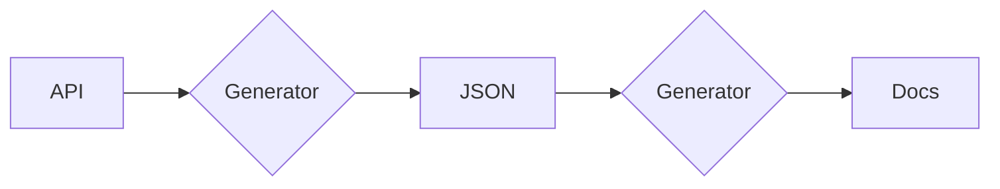

# Documenting an ASP.NET Core API with OpenAPI / Swagger

[By Kevin Dockx](https://twitter.com/KevinDockx)

<https://app.pluralsight.com/library/courses/aspdotnet-core-api-openapi-swagger/table-of-contents>

## Getting Started

* public apis need documentation
  * so do in-company APIs
* Documentation -> knowledge -> adoption
* OpenAPI specification
  * standardized description of web api
    * how to access it through HTTP
      * tools that use that specification
        * documentation UI can be generated

