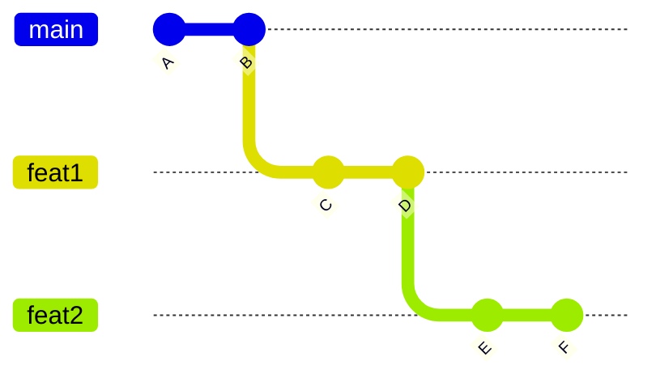
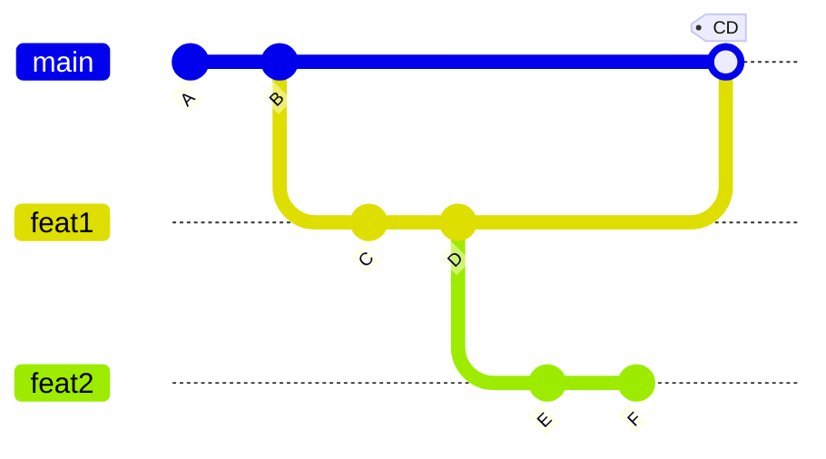
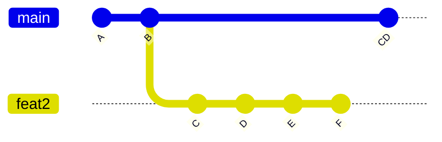
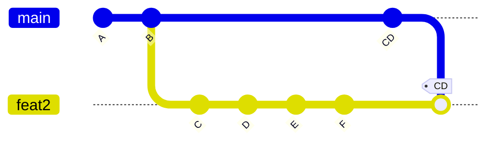
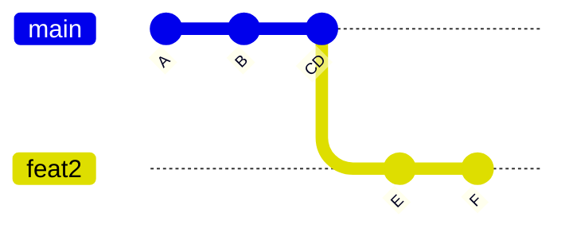
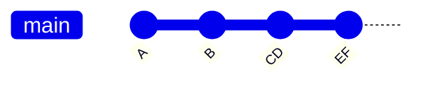
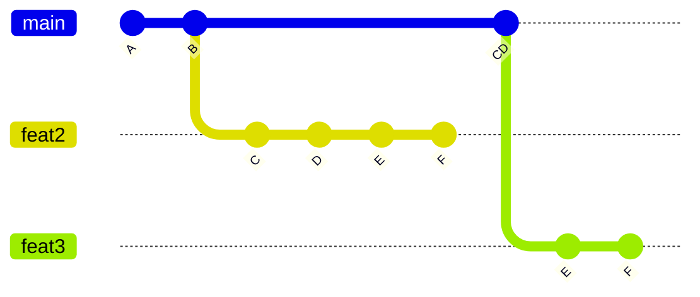

<!-- # Rebasing a branch of a branch after squash merging -->

Here's a question I asked on slack recently:

> When we do a branch off a branch,
> and then squash commit the original,
> is there a way to get the original commits to not show up on the new PR?

It's a a scenario that comes up not infrequently...

You're doing work on a branch, push up that work in a pull request, but while it's sitting in review, you want to keep plucking away.  Problem is, your next ticket depends on the original work, but doesn't really belong in the first PR without it getting too big and unwieldy.  So you make a *branch off your branch* and continue work there.

The problem arises if your organization uses squash commits when merging PRs.  That's not a problem in and of itself; IMO it's actually kinda nice (opinions differ).  But now the same work is sitting in two places, combined all together in the squash commit and also on your spun-off branch.  And because we squashed it, git doesn't really know enough to absolutely guarantee that it's the same work so doesn't offer much help.

### So what now?

The trick is to **rebase your branch with the updated version of `main`**, and drop all the early commits that have already made it's way back to the trunk.

But since rebasing is magic and git is voodoo, let's walk through step by step so we can better convince ourselves what's going on.

For the purposes of demonstration, we don't really care about files and merge conflicts, we just want to see how to push around commits from one branch to another, so I'll be using `--allow-empty` to bypass worrying about files in the first place.

Let's get an environment setup with the following git commands:


```bash
git init -b main
git commit -m "A" --allow-empty
git commit -m "B" --allow-empty

git checkout -b feat1
git commit -m "C" --allow-empty
git commit -m "D" --allow-empty

git checkout -b feat2
git commit -m "E" --allow-empty
git commit -m "F" --allow-empty
```

Here we're creating two commits, creating a branch `feat1`, creating 2 more commits, creating a branch `feat2`, and adding two more commits to that.

At this point, your git history should look like this:



Now we're ready to merge the original PR.  Normally, something like github would actually execute this for you, but we'll manually call `git merge` with the `--squash` arg, which will then stage all the changes and have us make a new commit to finish out the merge.

```bash
git checkout main
git merge --squash feat1
git commit -m "CD" --allow-empty
```

So git should now look like this:



Now let's delete `feat1` to better see what's going on and because we don't need it anymore anyway.

```bash
git branch -D feat1
```

> **Note**: you'll need to use uppercase `-D` to force delete the branch because the commits got squashed, so git isn't convinced they made it to main

So now git looks like this:




### Hopefully we can see the problem from here.

If we go to merge `feat2` into `main`, the work done by `C` and `D` individually is already represented by `CD`, but is double represented in our current branch.  At the end of the day, the diff should accurately reflect only the new work in `E` and `F`, but over a large series of commits, in can easily muddy the work actually going into this new PR.

You'll likely even merge `main` back into your branch because you need work done by other people or to fix merge conflicts.

Which makes everything look even messier:




### So, what do want to do instead?

We'll get on our 2nd feature branch and do an interactive rebase from main.  What this does is starts from the code that exists on main, and the decides which of the commits on our current branch we'd like to apply on top of main.

So start by checking out your feature branch and running rebase like this:

```bash
git checkout feat2
git rebase -i main
```

This will pull up a list of commits and actions in whatever editor you have set as the default for git, which will look something like this:

```git
pick 1530568 C # empty
pick c492b3f D # empty
pick a61cf2f E # empty
pick 4045e6b F # empty
```

What we're going to want to do is only keep the commits that are unique to our new branch by deleting the lines of previous commits.  Update the file like this, save, and close to continue the rebase

```git
pick a61cf2f E # empty
pick 4045e6b F # empty
```

This will now apply those two commits on top of all the changes in main, which should now look like this:



### Ahh, so nice and clean!

Now, you're all set to open up your next PR and do another squash merge:

```git
git checkout main
git merge --squash feat2
git commit -m "EF" --allow-empty
git branch -D feat2
```

Which should leave you with the final result:



And a really clean PR history to go back and review if you're trying to figure out how you got there.


<details>
  <summary>

## [Optional] What about Cherry Picking?

  </summary>


Because we're dealing with git here, there are plenty of valid ways to accomplish the same task.  I'll explore how to do this via cherry picking, but don't recommend for reasons discussed at the bottom.

So instead of rebasing off main, we would branch off main, and cherry pick the commits we want to bring over.  Picking up from merging `feat1`, we can run the following to branch off main and cherry pick the commits we want like this:

```bash
git checkout -b feat3 main
git cherry-pick feat2~1^..feat2 --allow-empty
```

Cherry pick allows you to specify a range of commits like this:

* `A..B` to take everything *after* `A` up to `B`
* `A^..B` to take everything *including* `A` up to `B`

There's also a handful of ways to specify a single commit, by sha, by tag, by branch, or by position, so

* `feat2` points to the commit at the HEAD of that branch
* `feat2~1` points to the commit `1` generation back from the HEAD of `feat2`

Ultimately, allowing us to select the last two commits on the branch like this:  `feat2~1^..feat2`

So now git should look like this:



So we could pickup work on `feat3` and get rid of `feat2`

The reason why rebasing is a little nicer for this use case, is because the `-i` interactive mode allows us to pick and choose much more easily which commits in our branch we want to keep, and also eliminates the need to switch to a new branch just to move commits around.


</details>


## Further Reading

* [How to cherry-pick a range of commits and merge them into another branch?](https://stackoverflow.com/q/1994463/1366033)
* [How to cherry-pick multiple commits](https://stackoverflow.com/q/1670970/1366033)

<details>
  <summary>

## Git Docs

  </summary>


* [`git init`](https://git-scm.com/docs/git-init)
* [`git commit`](https://git-scm.com/docs/git-commit)
* [`git checkout`](https://git-scm.com/docs/git-checkout)
* [`git merge`](https://git-scm.com/docs/git-merge)
* [`git branch`](https://git-scm.com/docs/git-branch)
* [`git rebase`](https://git-scm.com/docs/git-rebase)
* [`git cherry-pick`](https://git-scm.com/docs/git-cherry-pick)
* [`git-revisions`](https://git-scm.com/docs/gitrevisions)

</details>
